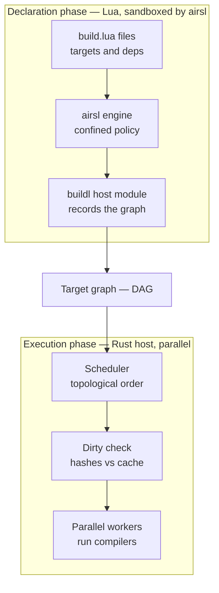
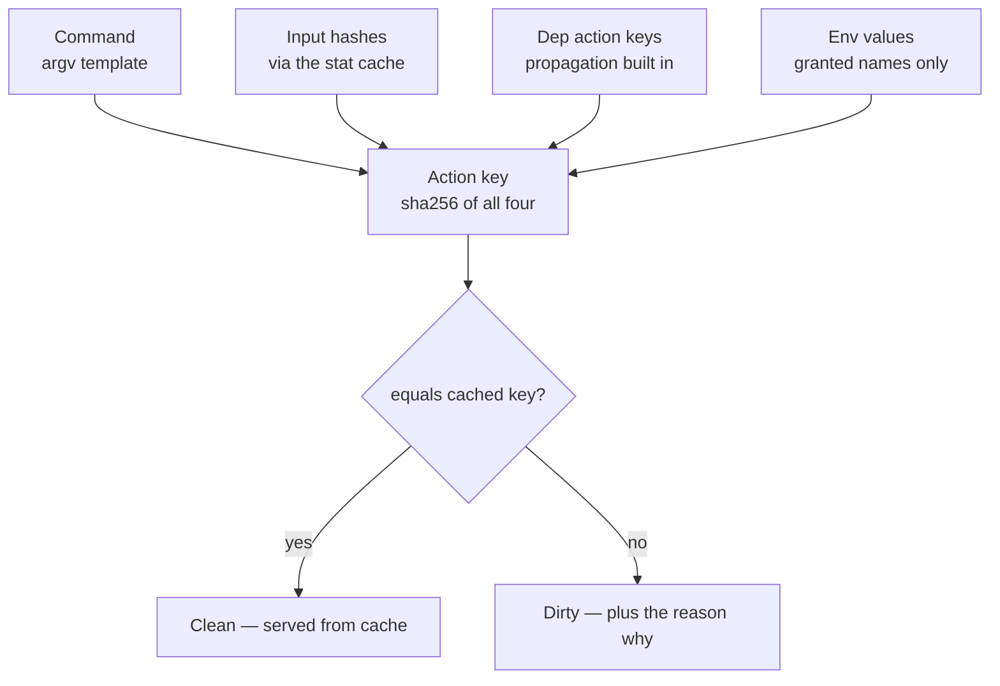
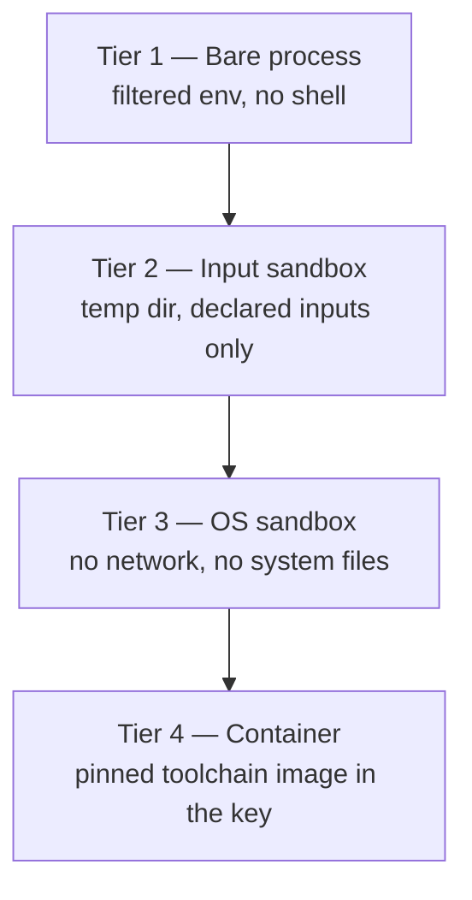

# buildl

**A sandboxed, deterministic build system whose build files are written in Lua and evaluated on the [airsl](https://github.com/airsstack/airsl) embedded runtime.**

The positioning in one sentence: Lua where Starlark sits in Bazel [5], ninja's execution discipline underneath [4], and airsl's capability model as the trust layer neither of them has.

> **Status: design phase.** Nothing described here is implemented yet. The design and internal architecture are specified in [`design.md`](./docs/design.md) and [`architecture.md`](./docs/architecture.md); one correctness question (dynamic input discovery — the depfile problem) is being resolved before development begins.

---

## Why buildl

buildl's founding constraint is inherited from airsl: **nothing is ambient**. A build file cannot read a file, spawn a process, or see an environment variable unless that authority was declared and granted. Where other build systems retrofitted hermeticity onto tools that assumed ambient authority [5], buildl starts from declared authority and adds capability.

Three properties follow from that constraint, and they are the product:

1. **Sandboxed build files.** A cloned repository's build files can be evaluated safely *before* any trust decision is made, because evaluation grants them nothing.
2. **Deterministic, explainable incrementality.** Dirtiness is decided by content hashes over declared inputs, so `buildl plan` can always answer *what* would rebuild and *why*.
3. **Visible authority.** The set of programs, paths, and environment variables a build may touch is derived from the build graph and checked against a workspace ceiling before anything executes.

Configuration languages for builds sit on a spectrum: inert data (YAML, TOML) cannot express repetition or conditionals; full scripting can express anything, including things a build file should never do. Lua-with-a-sandbox sits at the useful midpoint — real loops and functions, but a capability surface the host decides. xmake demonstrates the demand for Lua build configuration [9]; buildl differs by making the sandbox, not the convenience, the organizing principle.

## Architecture: declare, then execute

The single most important decision. Build files **declare**; the host **executes**. Lua never runs a compiler and never writes an artifact — it produces a description of the build, and the Rust host schedules, sandboxes, parallelises, and caches. This is the Bazel/ninja separation of concerns [4][5], with airsl's boundary enforcing it rather than convention.



The line between the two subgraphs is airsl's boundary. Declaration is safe on untrusted input (its only grant is filesystem read on the workspace, for source globbing); parallelism lives in the Rust worker pool, where it works; and a build file that loops forever is stopped by airsl's instruction ceiling before it wastes anyone's time.

## A taste of `build.lua`

```lua
local b = buildl

b.subdir("lib")                          -- host evaluates lib/build.lua in its own scope

b.rule("cc", {
  run  = { "cc", "-c", "$in", "-o", "$out" },
  desc = "compile $in",
})

for _, src in ipairs(b.sources("src/**/*.c")) do
  b.target(b.path.stem(src) .. ".o", { rule = "cc", inputs = { src } })
end

b.target("app", {
  deps = { "main.o", "util.o", "//lib:text" },   -- label syntax for cross-directory refs
  run  = { "cc", "$deps", "-o", "$out" },
})

b.alias("default", "app")
```

Design decisions visible in those lines: cross-directory references are graph **labels** (`//lib:text`) resolved in Rust, never `require` — build files reference each other's *targets*, not each other's code. Placeholders (`$in`, `$out`, `$deps`) expand host-side at run time, the ninja model [4]; Lua never holds a real artifact path. And `b.sources()` is the declaration phase's only filesystem read, returning sorted results so declaration is deterministic regardless of filesystem order.

Authority lives in `buildl.toml`, parsed by the host before any Lua runs — the workspace owner's statement of maximum authority, the **ceiling**:

```toml
[ceiling]
proc.run = ["cc", "ld", "go", "cargo", "bun", "docker", "protoc"]
env.read = ["HOME", "PATH", "GOCACHE", "CARGO_HOME"]
fs.read  = ["."]
fs.write = ["out", ".buildl", "target"]
```

There is no per-file capability manifest, because the build's authority is **derived, not requested**: after Resolve, the host walks the DAG, computes the wanted set (every program in every `run`, every env name, every output root), intersects it with the ceiling, and hands the result to an approver. A wanted program outside the ceiling refuses the plan at plan time, naming both sets — it never silently degrades the build.

## Incrementality: the action key

The core incremental mechanism, deliberately aligned with the Remote Execution API's action model [6][7]:



Because dep *keys* fold into the hash, dirtiness propagates downstream with no separate marking pass, and the mismatching component is retained per dirty target — that is the entire implementation of `buildl plan`'s explanations. Outputs land in a content-addressed store before the cache row is written, so an interrupted build simply continues on the next run: no "corrupt cache, run clean" state is representable, and failures are never cached.

Execution isolation is a ladder, set in `buildl.toml` with per-target overrides:



Tier 2 is Bazel's execroot discipline — undeclared inputs are simply absent, so hidden dependencies fail loudly [8]. The governing principle across all tiers: **every behavioral difference between two builds must be traceable to a difference in a declared input.**

## Commands

Each CLI command is the Load → Resolve → Plan → Execute → Record pipeline truncated at a different point:

| Command | Stops after | Purpose |
|---|---|---|
| `buildl check` | Load | syntax-check every build file, run nothing |
| `buildl graph` | Resolve | emit the DAG (`--json`, `--dot`) |
| `buildl plan` | Plan | dry run: what would rebuild, and why |
| `buildl build [target]` | Record | the full pipeline |
| `buildl watch [target]` | loops | persistent process, re-plans on file change |
| `buildl query <expr>` | Resolve | graph queries: `deps()`, `rdeps()` |
| `buildl test` / `clean` / `gc` | — | run test targets; drop outputs; prune the cas |
| `buildl doctor` | — | print the effective ceiling, grants, workers |

## Repository layout

A Cargo workspace mirroring airsl's shape — a library crate carrying everything public, a CLI crate that is a thin shell over it:

```text
buildl/
  crates/
    buildl/            # the library — manifest, declare, graph, plan, exec, store
    buildl-cli/        # the `buildl` binary: clap + phase orchestration
  docs/
    design.md          # what buildl is and why
    architecture.md    # how it is built in Rust
```

Workspace policy is inherited verbatim from airsl [1]: `unsafe_code = "forbid"`, `unwrap_used` and `panic` denied, pedantic + nursery clippy at warn, every dependency commented with its reason.

## Roadmap

Dependency-ordered, from [`design.md` §13](./docs/design.md). buildl is a **build system first** — the defining capability is answering *"does this need to run at all?"*; task-runner use is a degenerate case the model yields for free.

1. **Core pipeline** — Load/Resolve/Plan/Execute/Record, `run`/`plan`/`graph`/`check`, local cache and cas
2. **`query` / `rdeps`** — small work, transforms CI for large repos
3. **Local input sandbox (tier 2)** — the correctness discipline everything remote depends on
4. **Grant negotiation UX** — wanted set, ceiling intersection, approver
5. **Plugins** — manifest, attribution, `b.use()`
6. **Remote cache via REAPI** [7] — most of the remote value at a fraction of the complexity
7. **Watch mode** — full-reload variant first
8. **Remote execution, toolchain containers** — when a repo has genuinely outgrown one machine

## Part of airsstack

buildl is a project of the [airsstack](https://github.com/airsstack) ecosystem and is the first consumer of airsl's policy model, host-module seam, and (proposed) extension system. Design feedback is welcome — open an issue against `docs/design.md` or `docs/architecture.md`.

## License

Apache-2.0, following airsstack convention.

## References

1. airsstack. *airsl — Embeddable Lua runtime with a host standard library*. GitHub, 2026. URL: <https://github.com/airsstack/airsl>
2. airsstack. *airsl crate*. crates.io, 2026. URL: <https://crates.io/crates/airsl>
3. Reproducible Builds project. *SOURCE_DATE_EPOCH specification*. reproducible-builds.org. URL: <https://reproducible-builds.org/specs/source-date-epoch/>
4. Evan Martin et al. *The Ninja build system — manual*. ninja-build.org. URL: <https://ninja-build.org/manual.html>
5. Google / Bazel authors. *Hermeticity*. bazel.build. URL: <https://bazel.build/basics/hermeticity>
6. BuildBuddy. *Bazel's Remote Caching and Remote Execution Explained*. buildbuddy.io. URL: <https://www.buildbuddy.io/blog/bazels-remote-caching-and-remote-execution-explained/>
7. Bazel authors. *remote-apis — An API for caching and execution of actions on a remote system*. GitHub. URL: <https://github.com/bazelbuild/remote-apis>
8. Google / Bazel authors. *Sandboxing*. bazel.build. URL: <https://bazel.build/docs/sandboxing>
9. xmake-io. *Xmake — a cross-platform build utility based on Lua*. xmake.io. URL: <https://xmake.io/>
