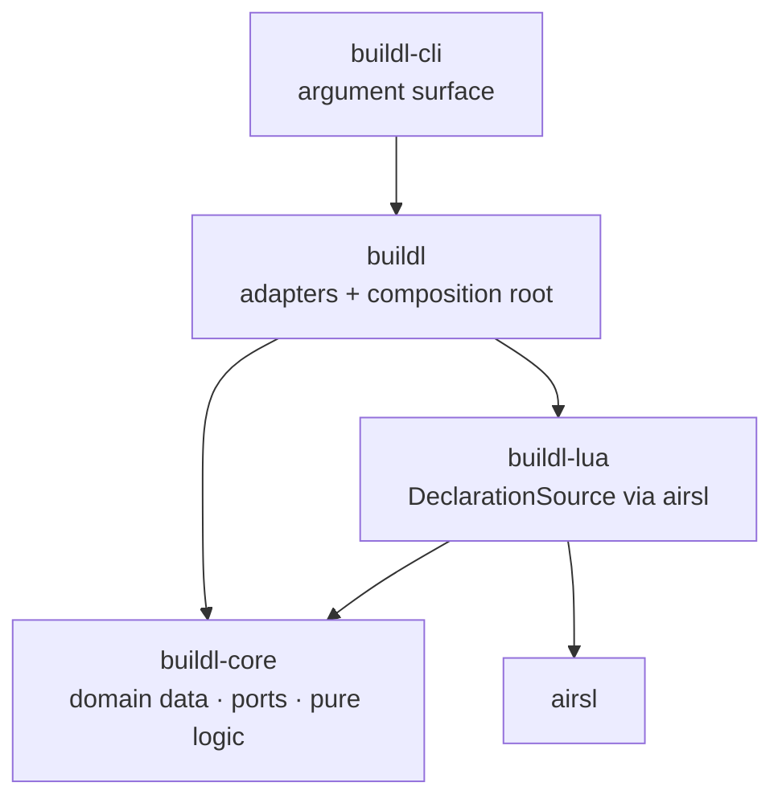
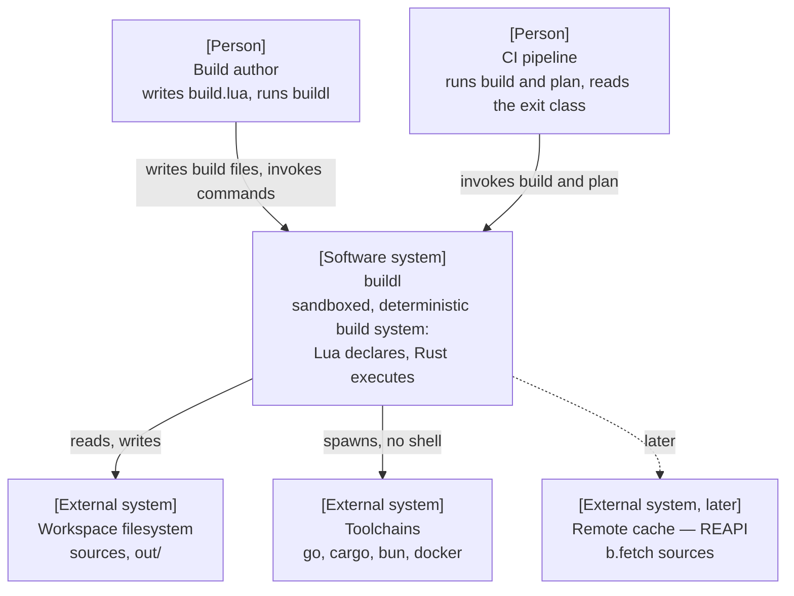
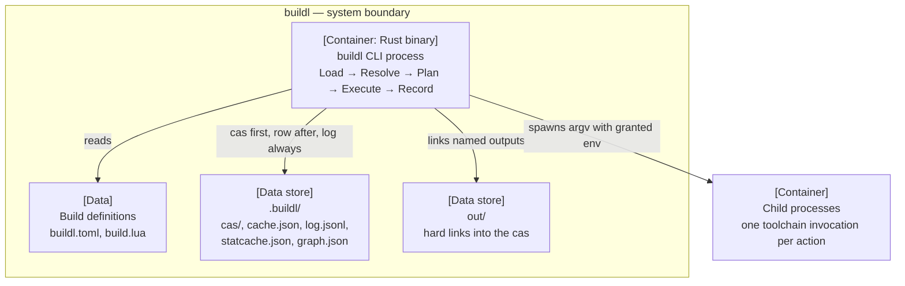
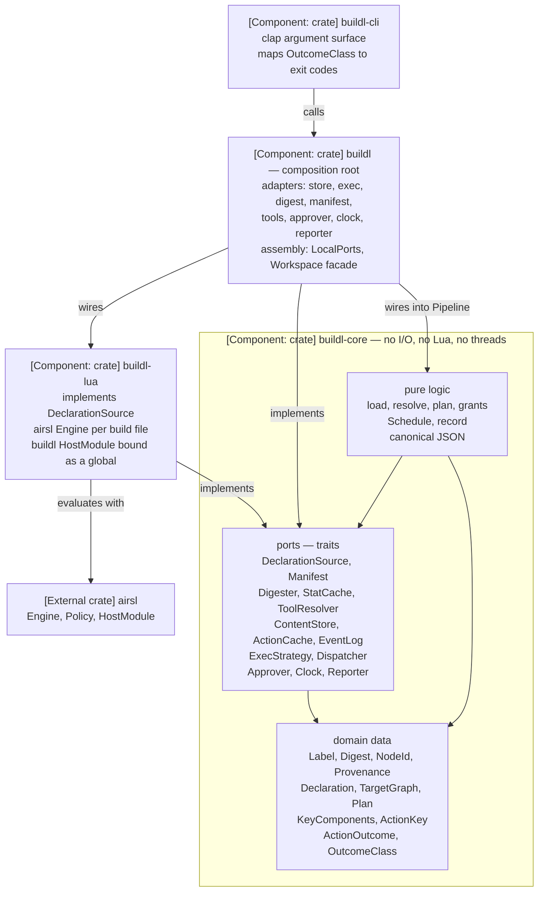
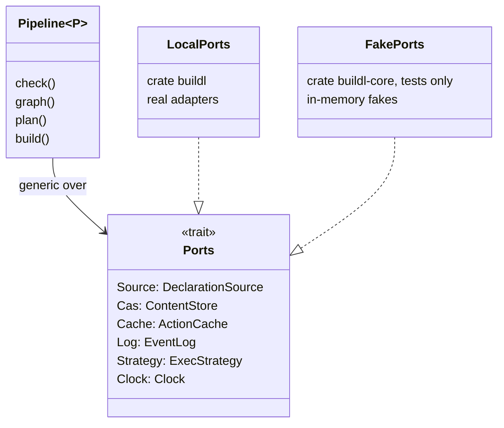
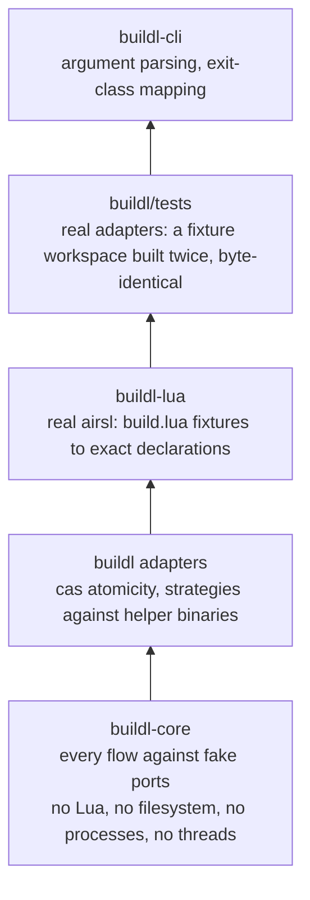
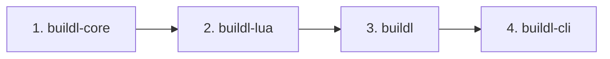

# buildl — architecture building blocks

**Status: draft for review.** Companion to [`design.md`](./design.md) and [`architecture.md`](./architecture.md): `design.md` says _what buildl is and why_, `architecture.md` says _how each part works_ — algorithms, types, determinism rules, runtime decision records — and this document says _how the parts are put together_: the C4 views of the system [2], the four crates, the ports between them, and the dependency rules that keep the logic of a build testable without any concrete implementation. It is the building block view of the architecture [8] and owns the workspace layout; `architecture.md` §1 defers to it.

**Author:** rstlix0x0 · **Date:** 2026-09-13 · **Reviewers:** —

---

## 1. Principles

### 1.1 Dependency inversion

The logic of a build — loading, resolving, planning, scheduling, recording — depends only on abstractions it defines itself. Concrete implementations (the airsl engine, the filesystem, child processes, threads, the system clock) depend on those abstractions, and exactly one place chooses which implementations run together [3]. The abstractions are _ports_ and the implementations are _adapters_ [4].



The consequence the structure exists for: **every flow of the pipeline runs in `buildl-core`'s unit tests against fake ports** — no Lua state, no filesystem, no process spawn, no thread (§8).

### 1.2 What `buildl-core` may depend on

Dependency inversion targets I/O and volatile subsystems. A stable library doing pure computation is not the implementation of a port, so the core may use one directly.

|`buildl-core` may depend on|`buildl-core` must not depend on|
|---|---|
|`std`, excluding its I/O, process, thread, environment, and clock APIs|`airsl`, `mlua`, `toml`, `clap`|
|`serde`, `serde_json`|`std::fs`, `std::process`, `std::thread`, `std::env`, `SystemTime`|
|`thiserror`|`rayon`, `tempfile`, `walkdir`, `globset`|
|`sha2`|any other buildl crate|

### 1.3 The name `buildl`

Three different things carry the name, and the crate structure keeps them apart:

|Name|What it is|Lives in|
|---|---|---|
|`buildl` binary|the command users run|`buildl-cli` (`[[bin]] name = "buildl"`)|
|`buildl` Lua global|the declaration framework build authors call (design §5)|`buildl-lua` (the `buildl` `HostModule`)|
|`buildl` Rust crate|the complete framework: every real adapter wired onto `buildl-core`|`crates/buildl`|

## 2. System context — C4 level 1



## 3. Containers — C4 level 2

A C4 container is a separately running process or a data store [2]. The crates are not containers: they compile into one process and appear at level 3.



## 4. Components — C4 level 3

Inside the CLI process. Arrows point at the dependency: every adapter depends on `buildl-core`, and no adapter depends on another.



|Crate|Role|Depends on|Must not depend on|
|---|---|---|---|
|`buildl-core`|domain data, ports, the pure logic of every phase|`serde`, `serde_json`, `thiserror`, `sha2`|any buildl crate, `airsl`, any I/O API|
|`buildl-lua`|the `DeclarationSource` adapter: evaluates one build file through airsl|`buildl-core`, `airsl`|`buildl`|
|`buildl`|every other adapter; `LocalPorts`; the `Workspace` facade; re-exports `buildl-core`|`buildl-core`, `buildl-lua`, plus each adapter's own dependencies|— (composition root, §7)|
|`buildl-cli`|argument surface and exit codes|`buildl`, `clap`|`buildl-core` and `buildl-lua` directly|

Adapter dependencies are finalised as each adapter lands, following the per-dependency reasons recorded in the workspace `Cargo.toml`.

## 5. Code — C4 level 4: `buildl-core`

The signatures below are the shape, not the final API.

### 5.1 Domain data

Every value is a validated newtype or a serializable handoff; field-level detail is in `architecture.md` §2.

|Kind|Types|
|---|---|
|Names and identity|`Label`, `NodeId`, `Provenance`|
|Content|`Digest` — the single SHA-256 type for files, outputs, keys, and log blobs|
|Phase handoffs|`Declaration`, `TargetGraph`, `Plan`, `ActionOutcome`|
|Incrementality|`KeyComponents`, `ActionKey`|
|Authority|`Ceiling`, `WantedSet`, `Grants`|
|Classification|`OutcomeClass` (`#[non_exhaustive]`, `architecture.md` §4)|

### 5.2 Ports

```rust
/// Evaluates one build file. The directory queue, `subdir` handling, and the
/// sorted merge across files are Load logic in `buildl-core`, not the adapter's.
pub trait DeclarationSource {
    fn evaluate(&self, file: &BuildFile) -> Result<StagedFile, LoadError>;
}

/// Workers write output blobs concurrently.
pub trait ContentStore: Send + Sync {
    fn put(&self, bytes: &[u8]) -> Result<Digest, StoreError>;
    fn contains(&self, digest: &Digest) -> bool;
}

/// The scheduler side is the single writer.
pub trait ActionCache {
    fn row(&self, label: &Label) -> Option<&CacheRow>;
    fn upsert(&mut self, label: Label, row: CacheRow);
    fn commit(&mut self) -> Result<(), StoreError>;
}

pub trait EventLog {
    fn append(&mut self, event: &OutcomeEvent) -> Result<(), StoreError>;
}

pub trait ExecStrategy: Send + Sync {
    /// Each isolation tier materialises a differently shaped exec dir.
    type Dir;
    fn prepare(&self, action: &ReadyAction) -> Result<Self::Dir, InfraFailure>;
    fn run(&self, dir: &Self::Dir, action: &ReadyAction) -> Result<RawOutcome, InfraFailure>;
}

pub trait Clock {
    fn now(&self) -> Timestamp;
}
```

### 5.3 `Pipeline` and the `Ports` bundle

Static dispatch throughout [7]. One trait of associated types carries every port, so `Pipeline` takes a single type parameter instead of one per port.

```rust
pub trait Ports {
    type Source: DeclarationSource;
    type Cas: ContentStore;
    type Cache: ActionCache;
    type Log: EventLog;
    type Strategy: ExecStrategy;
    type Clock: Clock;
    // Manifest, Digester, StatCache, ToolResolver, Dispatcher, Approver, Reporter
}

pub struct Pipeline<P: Ports> { /* one field per port */ }

// in `buildl`:
pub type LocalPipeline = Pipeline<LocalPorts>;
```



### 5.4 Pure logic

|Logic|Input → output|Ports used|
|---|---|---|
|load|workspace root → `Vec<Declaration>` (queue, `subdir`, sorted merge)|`DeclarationSource`|
|resolve|`Vec<Declaration>` → `TargetGraph` (validations, cycle detection)|—|
|plan|`TargetGraph` → `Plan` (key assembly, dirty reasons)|`Digester`, `StatCache`, `ToolResolver`, `ActionCache`|
|grants|wanted set ∩ ceiling → grants or refusal|`Manifest`, `Approver`|
|`Schedule`|pure state machine: `ready()`, `complete(node, class)`|— (driven through `Dispatcher`)|
|record|`ActionOutcome` → cas, then row, then log|`ContentStore`, `ActionCache`, `EventLog`, `Clock`|
|canonical JSON|value → sorted-key bytes|—|

## 6. Port catalog

|Port|`buildl-core` uses it for|v1 adapter|Crate|
|---|---|---|---|
|`DeclarationSource`|Load — one build file at a time|airsl engine per file, `buildl` module table|`buildl-lua`|
|`Manifest`|ceiling, declaration limits, settings|`buildl.toml` reader|`buildl`|
|`Digester`|input content hashes|filesystem + rayon|`buildl`|
|`StatCache`|reusing digests on unchanged mtime + size|`.buildl/statcache.json`|`buildl`|
|`ToolResolver`|tool fingerprints in the key|`PATH` lookup + fingerprint|`buildl`|
|`ContentStore`|the cas|`.buildl/cas/ab/…`, temp file then rename|`buildl`|
|`ActionCache`|cache rows|`.buildl/cache.json`|`buildl`|
|`EventLog`|one event per outcome|`.buildl/log.jsonl`|`buildl`|
|`ExecStrategy`|running one action|`Bare` (tier 1), `InputSandbox` (tier 2)|`buildl`|
|`Dispatcher`|running ready actions in parallel|std threads + `mpsc`|`buildl`|
|`Approver`|turning the wanted set into grants|interactive, manifest|`buildl`|
|`Clock`|log timestamps and durations|system clock|`buildl`|
|`Reporter`|output blocks and the status line|TTY, plain|`buildl`|

The `Clock` port is `architecture.md` §5.4's quarantine of the wall clock, enforced by the crate boundary: `buildl-core` has no way to read time except through the port.

## 7. Dependency rules

1. **`buildl-core` depends on no buildl crate, no airsl, and no I/O API** (§1.2).
2. **Adapters depend on `buildl-core` only.** `buildl-lua` never imports `buildl`; inside `buildl`, adapter modules never import each other.
3. **`buildl` is the single composition root** — the only code that names more than one concrete adapter, through `LocalPorts`. This is dependency inversion applied, not violated: the principle constrains the logic, and a composition root is where concrete choices are made [3].
4. **`buildl-cli` reaches core types through `buildl`'s re-exports**, so the binary has one library dependency.

|Rule|Enforced by|
|---|---|
|1, 4, and the cross-crate half of 2|the compiler — a crate cannot import what its `[dependencies]` does not list|
|adapter isolation inside `buildl`|review, until an adapter earns its own crate (§11)|

## 8. Testing layers



The fakes live in `buildl-core` under `#[cfg(test)]`:

|Port|Fake|What the test no longer needs|
|---|---|---|
|`DeclarationSource`|static declarations per file|airsl, Lua|
|`ContentStore`, `ActionCache`, `EventLog`|in-memory, with injectable failures|a filesystem|
|`ExecStrategy`|scripted outcomes per label|process spawning|
|`Dispatcher`|inline, on the test thread|threads; results are deterministic|
|`Clock`|fixed|wall-clock time|

Flows that run entirely in `buildl-core`'s tests:

|Scenario|Assertion|
|---|---|
|`//:a` fails under `--keep-going`|summary `1 failed, 2 skipped, 2 built`|
|cas write succeeds, cache commit fails|no row for the target — the crash-safety invariant (design §8.5)|
|rebuilt output byte-identical|downstream targets stay `Clean` — early cutoff|
|wanted program outside the ceiling|`Refusal` before any strategy runs|
|one input changed|dirty reason is the `KeyComponents` diff|
|a build file enqueues subdirectories out of order|merged declarations sorted by directory, then declaration order|

## 9. Publishing

`buildl-cli` is published to crates.io, and crates.io accepts a crate only when its dependencies are published too [6], so all four crates publish, dependency first:



|Requirement|Form|
|---|---|
|internal dependencies|`buildl-core = { version = "…", path = "crates/buildl-core" }` in `[workspace.dependencies]`; packaging keeps the version and drops the path|
|version sync|each workspace dependency version matches the crate's own version|
|metadata|`description` and `readme` per crate; `license` and `repository` inherited from the workspace|
|crate `README.md`|written for crates.io readers of that crate|

All four names were unclaimed on crates.io on 2026-09-13; a name is claimed only by its first publish.

Once published, the ports are a semver contract:

|Concern|Rule|
|---|---|
|sealed or open|**open** — adapters live in other crates, and a sealed trait cannot be implemented outside its own crate [5]|
|growing a port|new methods get default bodies; a required method breaks every implementor|
|growing data|`#[non_exhaustive]` on enums and structs expected to gain variants or fields|
|version line|`0.x` until the port surface settles|

## 10. Decision records

|Decision|Choice|Because|
|---|---|---|
|Where the core lives|**A crate, `buildl-core`** — not a `core` module|A crate-root `mod core` shadows Rust's built-in `core` crate: `use core::fmt::Debug;` fails with `error[E0432]: unresolved import core::fmt` — "could not find `fmt` in `core`" (rustc 1.91.1). A crate boundary also turns the dependency rules into compiler errors.|
|Crate cut|**Four crates**|Only airsl brings a C build and a distinct upgrade risk, so only the Lua adapter earns its own crate; the other adapters share `buildl` until a concrete reason to split appears (§11). `cargo test -p buildl-core` never compiles Lua.|
|Composition root|**`buildl`, not `buildl-cli`**|Embedders — watch mode, editors, other tools — get a wired `Workspace` without copying the CLI's wiring; end-to-end tests live beside the real adapters; the scaffold's crate descriptions already call the CLI a thin shell over the library.|
|Port dispatch|**Generics with one `Ports` bundle**|Static dispatch [7] without a type parameter per port on `Pipeline`.|
|Port openness|**Open, unsealed traits**|Adapters are implemented in other crates [5]; ports grow through default methods.|
|Scheduler|**Pure `Schedule` + `Dispatcher` port**|Keep-going and skip semantics are testable without threads; the scheduler was already the single writer (`architecture.md` §3.4), so counters need no atomics.|
|Load granularity|**`DeclarationSource` evaluates one file**|The directory queue and the sorted merge are determinism-bearing logic, so they stay in `buildl-core` where fakes can test them.|
|Diagram notation|**Mermaid `graph` with C4 element labels**|Renders wherever the other documents' Mermaid renders; Mermaid's dedicated C4 syntax is marked experimental.|

## 11. Open questions

- Whether a shared test kit of fake ports is published or kept internal, once `buildl` or `buildl-lua` tests need `buildl-core`'s fakes.
- Where `b.sources()` globbing runs: through `airsstack.glob.walk` inside `buildl-lua`, or host-side behind a port — the workspace `Cargo.toml` currently catalogs `globset` and `walkdir` for it.
- When an adapter inside `buildl` earns its own crate: an independent consumer, a heavy dependency, or a platform-specific build.

## References

1. airsstack. _airsl — Embeddable Lua runtime with a host standard library_ (source and docs). GitHub, 2026. URL: [https://github.com/airsstack/airsl](https://github.com/airsstack/airsl)
2. Simon Brown. _The C4 model for visualising software architecture_. c4model.com. URL: [https://c4model.com/](https://c4model.com/)
3. Robert C. Martin. _The Dependency Inversion Principle_. C++ Report, 1996.
4. Alistair Cockburn. _Hexagonal architecture (ports and adapters)_. URL: [https://alistair.cockburn.us/hexagonal-architecture/](https://alistair.cockburn.us/hexagonal-architecture/)
5. Rust library team. _Rust API Guidelines — Future proofing (C-SEALED)_. URL: [https://rust-lang.github.io/api-guidelines/future-proofing.html](https://rust-lang.github.io/api-guidelines/future-proofing.html)
6. The Cargo team. _The Cargo Book — Publishing on crates.io_. URL: [https://doc.rust-lang.org/cargo/reference/publishing.html](https://doc.rust-lang.org/cargo/reference/publishing.html)
7. Microsoft. _Pragmatic Rust Guidelines_. URL: [https://microsoft.github.io/rust-guidelines/](https://microsoft.github.io/rust-guidelines/)
8. arc42. _Building block view_. URL: [https://docs.arc42.org/section-5/](https://docs.arc42.org/section-5/)
