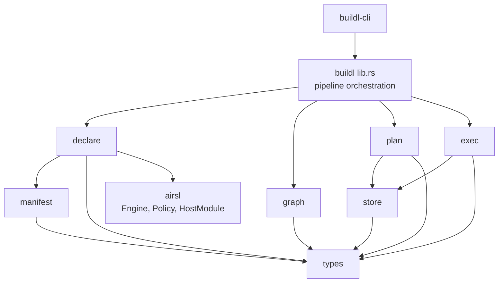
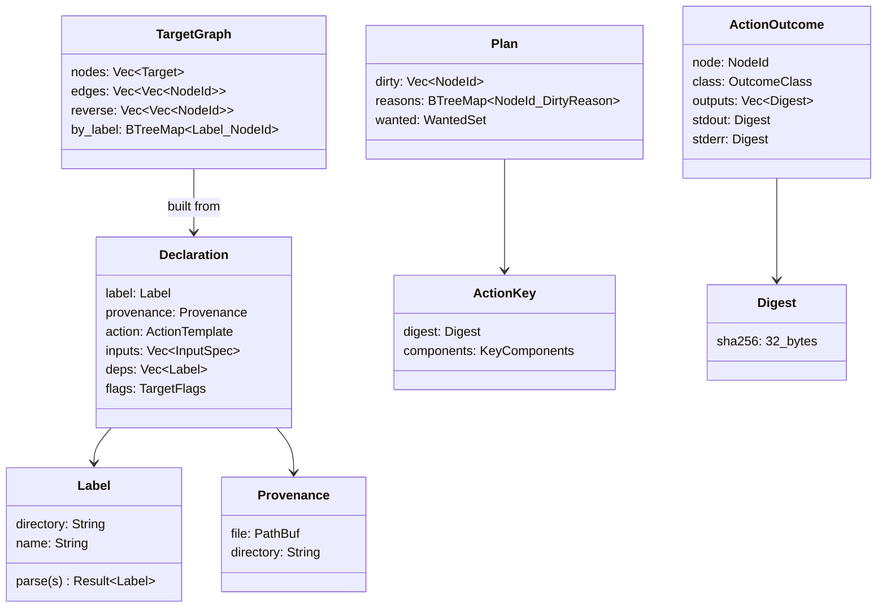
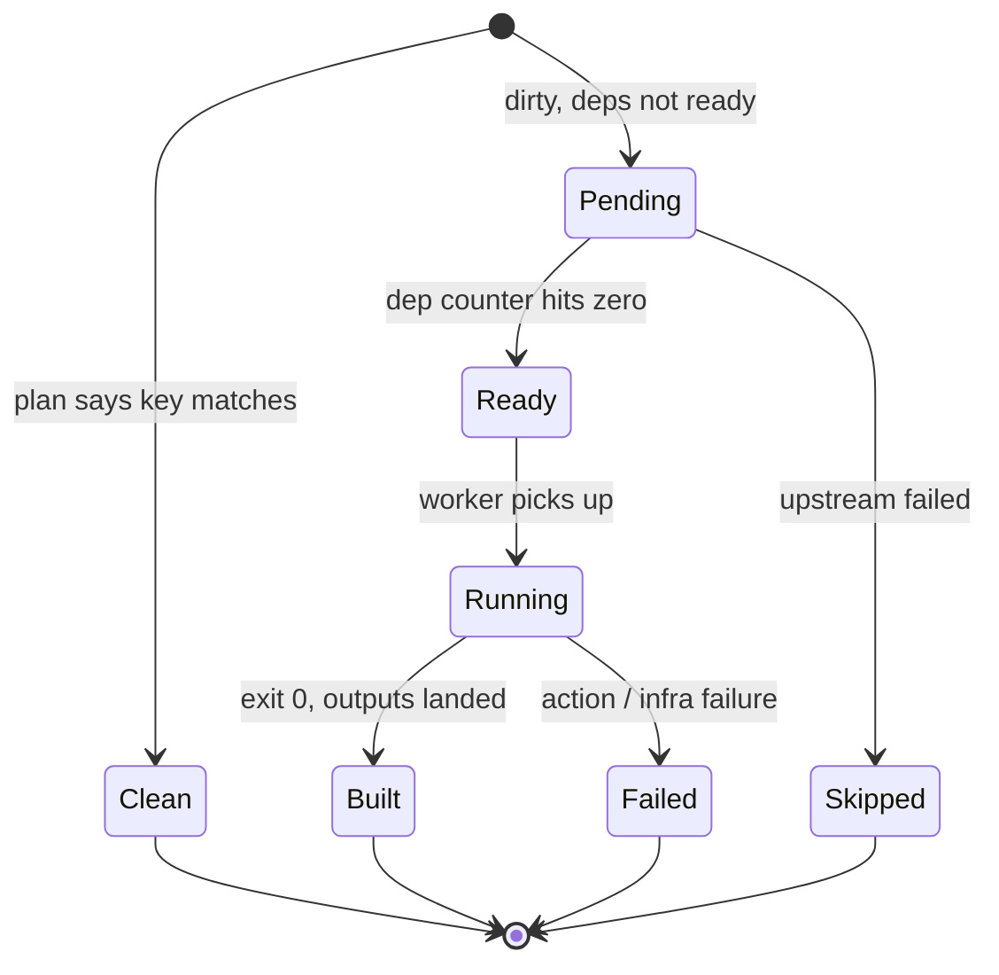

# buildl — internal architecture

**Status: draft for review.** Companion to [`buildl-design.md`](https://claude.ai/cowork/buildl-design.md): that document says _what buildl is and why_; this one says _how it is built in Rust_. Scope follows the §13 decision there — the build-system core first: Load → Resolve → Plan → Execute → Record, the action cache and cas, and the `check` / `graph` / `plan` / `build` commands. Plugins, remote, and watch are designed for but not implemented by anything here.

**Author:** rstlix0x0 · **Date:** 2026-08-23 · **Reviewers:** —

---

## 1. Workspace layout

Mirrors airsl's own workspace shape [1]: a library crate carrying everything public, a CLI crate that is a thin shell over it.

```text
buildl/
  Cargo.toml                 # workspace: resolver 3, shared lints (airsl's lint set)
  crates/
    buildl/                  # the library — all logic lives here
      src/
        lib.rs
        manifest/            # buildl.toml: parsing, ceiling, validation
        declare/             # Load phase: engine-per-file, the HostModule, staging
        graph/               # Resolve phase: interning, labels, validation, the DAG
        plan/                # Plan phase: action keys, stat cache, dirty set
        exec/                # Execute phase: scheduler, workers, strategies, output
        store/               # cas, action cache, log — all durable state
        settings/            # build settings (b.option / --set)
        types/               # newtypes: Label, Digest, ActionKey, Provenance, ...
        error.rs             # error enum + classification
      tests/                 # phase-boundary integration tests
    buildl-cli/              # the `buildl` binary: clap + phase orchestration
      src/
        main.rs
        cli.rs               # argument surface
        cmd_build.rs  cmd_plan.rs  cmd_graph.rs  cmd_check.rs  cmd_doctor.rs
```

Inherited workspace policy, verbatim from airsl [1]: `unsafe_code = "forbid"`, `unwrap_used` and `panic` denied, pedantic + nursery clippy at warn, every dependency commented with its reason in the workspace `Cargo.toml`.

### 1.1 Module dependency graph

Modules depend strictly downward; the phase modules never depend on each other laterally — they meet only through the types crate-module and the store:



Two structural rules the graph encodes:

- **airsl is a dependency of `declare` only.** No other module knows Lua exists. The whole runtime boundary is one module deep, which is what keeps the execution side testable without a Lua state and keeps an airsl upgrade's blast radius contained.
- **Phases communicate through values, not calls.** `declare` produces `Vec<Declaration>`, `graph` consumes it and produces `TargetGraph`, `plan` produces `Plan`, `exec` produces `Vec<ActionOutcome>`. `lib.rs` owns the sequence; no phase invokes the next. This is §8 of the design doc made literal: each handoff is a serializable value, so each phase is unit-testable alone and `buildl graph` / `buildl plan` are just serializations of a handoff.

## 2. Core types

All in `types/`, all newtypes over primitives, following airsl's `types/` discipline (`ModuleName`, `RootTable`, `ChunkName` — validated at construction, impossible to construct invalid) [1].



The load-bearing decisions:

- **`Label` is the universal name** (`//dir:name`), parsed and validated once at Resolve; everywhere downstream a target is a `NodeId` (`u32` index into the graph's arenas). Strings appear only at the edges — parsing and reporting.
- **`ActionKey` keeps its components.** The key is a digest _of_ a `KeyComponents` struct (command, input digests, dep keys, env values, tool fingerprints, settings, os/arch — the §12.4 ledger as a Rust struct). Keeping the components alongside the digest is what makes `plan`'s "why dirty" reporting a struct diff instead of archaeology.
- **`Digest` is SHA-256 everywhere** — files, outputs, keys, log blobs — matching the Remote Execution API's digest model [4] so the remote-cache step later is a transport problem, not a re-keying.
- **`Provenance` is threaded, never reconstructed.** Attached in `declare`, carried through `Declaration` into `Target`, surfaced in every error. No phase ever asks "which file declared this?" — it always already knows.

### 2.1 The target state machine

Each node in an executing build moves through exactly these states — this enum _is_ the scheduler's bookkeeping:



`Clean` and `Skipped` are terminal without ever running — the two states a task runner cannot represent, and the reason the summary line can say `1 failed, 2 skipped, 2 built, 9 cached`.

## 3. Phase implementations

### 3.1 `declare` — the airsl boundary

The only module that speaks Lua. Per build file: construct an `Engine` with the declaration policy (custom `LanguageSurface` without `os`, curated `ModuleSet` — design doc §12.1), evaluate, drop the engine (~136 µs; isolation by disposal [1]).

The mechanics of collection: the `buildl` `HostModule`'s closures capture an `Arc<Mutex<Vec<Declaration>>>` staging buffer plus the current file's `Provenance`. `b.target(...)` validates its option table shape _immediately_ (unknown field → error naming file and field, airsl-refusal style) and pushes a `Declaration`. `b.subdir(dir)` pushes onto the directory queue owned by the Load driver — Lua never recurses.

Parallel load: the directory queue is processed by a small pool; each worker owns its engines, staging buffers merge at the end, and the merge sorts by (directory, declaration order) so parallel load yields the identical staging list as serial load. Determinism rule: parallelism must never be observable in any output (§6).

### 3.2 `graph` — arenas, not pointers

`TargetGraph` is struct-of-arrays with `u32` node ids: `nodes: Vec<Target>`, `edges: Vec<Vec<NodeId>>` (deps), `reverse: Vec<Vec<NodeId>>`, plus `by_label: BTreeMap<Label, NodeId>`. Petgraph [2] was considered and declined for the core structure — the graph is built once, never mutated, needs exactly toposort/cycle-detection/reachability, and owning the representation keeps it `serde`-serializable as the stable `graph.json` without an adapter layer. (Nothing prevents using petgraph algorithms _over_ this representation later if `query` grows complex.)

Cycle detection is iterative DFS (explicit stack — a deep graph must not overflow the call stack; airsl's require-loader made the same choice for the same reason [1]). The error carries the full cycle path as labels with provenance.

### 3.3 `plan` — keys and the stat cache

Bottom-up over a toposort. Per node: assemble `KeyComponents`, hash inputs through the stat cache, fold dep keys (already computed — toposort guarantees it), digest the canonical serialization of the components.

The stat cache is a `BTreeMap<PathBuf, StatEntry { mtime, size, digest }>` loaded from `.buildl/statcache.json`; a hit on (mtime, size) reuses the digest, a miss re-hashes and updates — ninja's mtime discipline with content-hash truth underneath [3]. File hashing fans out with rayon's parallel iterators [5] — files are independent, the work is chunkable, and rayon's pool is confined to the `plan` module (decision record §6).

Output: `Plan { dirty, reasons, wanted }` — and the ceiling check runs here, so a `Plan` that would exceed the ceiling is an `Err`, not a plan.

### 3.4 `exec` — the scheduler

Plain threads, no async runtime (decision record §6). The scheduler owns: the state array (§2.1), dep counters (`Vec<AtomicU32>`), a ready queue (`std::sync::mpsc` channel), and N worker threads. Workers loop: receive `NodeId` → run the action through the strategy (below) → send `ActionOutcome` back on a results channel. The scheduler thread is the only writer of states and counters on completion — single-writer bookkeeping, so no lock ordering to reason about.

Execution strategies are one trait, the design doc's isolation ladder (§12.2) as code:

```rust
pub trait ExecStrategy: Send + Sync {
    /// Materialise the action's exec dir (inputs visible per this strategy's tier).
    fn prepare(&self, action: &ReadyAction) -> Result<ExecDir>;
    /// Spawn and wait, capturing output. No shell, ever.
    fn run(&self, dir: &ExecDir, action: &ReadyAction) -> Result<RawOutcome>;
}
```

v1 ships `Bare` (tier 1: workspace cwd, granted env only) and `InputSandbox` (tier 2: temp dir, symlinked declared inputs). `OsSandbox` and `Container` are later impls of the same trait — the trait is in v1 so the ladder is a seam, not a refactor.

Output capture: piped stdout/stderr read by two threads per action into buffers, blobs written to the cas, digests recorded on the outcome. Printing is owned by a single reporter on the scheduler side (block per completed action; TTY status line) — workers never touch the terminal.

### 3.5 `store` — cas, action cache, log

The cas is `.buildl/cas/ab/cdef...` (two-char shard dirs). Every write is temp-file-then-rename within the same filesystem — atomic, the `fs.atomic_write` discipline [1]. `out/` entries are hard links into the cas (copy fallback for filesystems that refuse). The action cache is a `BTreeMap<Label, CacheRow { key: Digest, outputs: Vec<Digest>, stdout, stderr }>` serialized as sorted-key JSON; rewritten atomically once per build, rows updated in memory as outcomes land — write ordering enforces the §8.5 invariant: **cas first, row after, log always**. `log.jsonl` is append-only, one sorted-key JSON object per outcome, output blobs referenced by digest rather than inlined.

`gc` walks roots (current `graph.json` outputs + cache rows) and unlinks unreferenced cas entries — refcounting deferred; mark-and-sweep is enough at v1 scale.

## 4. Error architecture

One `thiserror` enum in the library, airsl-style: structured fields, no message parsing anywhere [1]. The design doc's three failure classes (§8.7) are a `#[non_exhaustive]` enum carried _on_ errors and outcomes, not inferred from them:

```rust
pub enum OutcomeClass {
    Built,
    Cached,
    ActionFailure { status: i32 },          // the build did its job
    InfraFailure { kind: InfraKind },       // missing tool, sandbox, timeout
    Refusal { wanted: Wanted, ceiling: CeilingRef },  // plan-time only
    Skipped { because: NodeId },
}
```

Classification is structural at the site that knows (spawn error vs non-zero exit vs timeout flag), never downstream. The CLI maps classes to exit codes; `log.jsonl` carries the class verbatim. Every error that can name a target carries `Label + Provenance`; the display impl renders airsl-refusal-shaped messages — what was wanted, what was granted or found, where it was declared.

## 5. Determinism engineering rules

House rules enforcing design-doc §12 at the code level — checkable in review, some in CI:

1. **No `HashMap` iteration reaches any output.** Anything serialized, displayed, or hashed iterates a `BTreeMap`/sorted `Vec`. (`HashMap` is fine as a pure lookup table.)
2. **All JSON leaves through one canonical serializer** — sorted keys, fixed float handling. `graph.json`, `cache.json`, `log.jsonl`, and the bytes hashed into an `ActionKey` all use it, so "the key of X" and "the file of X" can never disagree.
3. **Parallelism is never observable.** Parallel load merges sorted (§3.1); parallel hashing writes into pre-indexed slots; the executor's completion _order_ appears only in the log's timestamps, never in any artifact.
4. **Wall clock is quarantined.** `now()` is read in exactly two places — log event timestamps and durations — via one `clock.rs` helper; nothing else in the library may name time. Grep-enforceable.
5. **Double-run checks are CI, not doctrine.** `buildl check` runs declaration twice and diffs staging hashes; the test suite builds a fixture workspace twice and asserts byte-identical `graph.json`, `cache.json`, and cas contents.

## 6. Decision records

|Decision|Choice|Because|
|---|---|---|
|Async runtime|**None — threads**|The workload is process-spawning and file-hashing: worker count ≈ core count, no fan-out beyond it, no IO multiplexing need. An async runtime buys nothing and costs a dependency tree and an ecosystem split. Revisit only if remote execution's network fan-out demands it.|
|Graph library|**Own arenas; petgraph declined** [2]|Built once, immutable, three algorithms needed, must serialize stably (§3.2).|
|Parallel hashing|**rayon, confined to `plan`** [5]|Chunkable CPU-bound work is its exact use case; confining it keeps the executor's threading model singular.|
|Hash|**SHA-256**|REAPI compatibility [4] outweighs blake3's speed; the stat cache makes hashing rare on warm builds anyway.|
|Cache files|**JSON via the canonical serializer**|Diff-stable and debuggable beats compact; airsl's sorted-key JSON is the precedent [1]. Binary formats only if profiling demands.|
|Worker/scheduler channel|**std mpsc**|One producer set, one consumer, no select needed; crossbeam only if the reporter grows a second consumer.|
|Lua exposure|**`declare` module only**|An airsl (or mlua [6]) upgrade touches one module; everything else compiles Lua-free.|

## 7. Testing strategy

The narrow handoffs are the test surface:

- **`declare`**: fixture build files → assert exact `Vec<Declaration>`; hostile fixtures (huge loops, `pairs` tricks, bad option tables) → assert refusal shape and instruction-ceiling stops.
- **`graph`**: staging lists (no Lua) → golden `graph.json`; duplicate/unknown/cycle fixtures → assert full provenance in errors.
- **`plan`**: synthetic graphs + a tempdir tree → dirty sets and reasons; stat-cache hit/miss/mtime-rollback cases.
- **`exec`**: fake actions (`/bin/sh`-free — tiny compiled helpers) → state-machine transitions, keep-going semantics, output block integrity, crash-safety (kill a worker mid-action, assert no cache row).
- **End-to-end**: a fixture workspace built twice — second run all-cached and byte-identical state (§5.5); then one file touched — assert exactly the expected dirty closure rebuilds.
- **The airsl repo as dogfood** (design doc §13): buildl's own gate eventually runs under buildl.

## 8. Open implementation questions

- Whether `ExecDir` materialisation for `InputSandbox` uses symlinks (fast, but visible to tools that `readlink`) or hard links (opaque, but same-filesystem only) — likely per-strategy config with hard links default.
- Whether the stat cache should be keyed by `(dev, inode)` in addition to path, to survive renames without re-hashing.
- Where settings (`--set`) validation lives: `manifest` (they're workspace surface) vs `settings` (they're invocation surface) — leaning `settings`, validated against declarations at Resolve.
- Whether `graph.json` is written on every build or only on `buildl graph` — writing always makes `gc` roots simpler; measuring the cost first.

## References

1. airsstack. _airsl — source and docs (architecture.md, sandbox.md; workspace Cargo.toml lint and dependency policy)_. GitHub, 2026. URL: [https://github.com/airsstack/airsl](https://github.com/airsstack/airsl)
2. petgraph developers. _petgraph — graph data structures and algorithms (toposort)_. docs.rs. URL: [https://docs.rs/petgraph/](https://docs.rs/petgraph/)
3. Evan Martin et al. _The Ninja build system — manual_. ninja-build.org. URL: [https://ninja-build.org/manual.html](https://ninja-build.org/manual.html)
4. Bazel authors. _remote-apis — Digest and ActionCache model_. GitHub. URL: [https://github.com/bazelbuild/remote-apis](https://github.com/bazelbuild/remote-apis)
5. rayon developers. _rayon — data parallelism with work stealing_. crates.io. URL: [https://crates.io/crates/rayon](https://crates.io/crates/rayon)
6. khvzak et al. _mlua — Lua bindings for Rust_. crates.io. URL: [https://crates.io/crates/mlua](https://crates.io/crates/mlua)
