# buildl — design document

**Status: draft for review.** Nothing described here is implemented. Every design decision builds on the shipped `airsl` runtime [1][2]; sections note where buildl depends on airsl work that is itself still proposed (the extension system).

**Author:** rstlix0x0 · **Date:** 2026-08-23 · **Reviewers:** —

---

## 1. Overview

`buildl` is a build system whose build files are written in Lua and evaluated on the [`airsl`](https://github.com/airsstack/airsl) embedded runtime [1]. Its founding constraint is inherited from airsl: **nothing is ambient**. A build file cannot read a file, spawn a process, or see an environment variable unless that authority was declared and granted. Where other build systems retrofitted hermeticity onto tools that assumed ambient authority [5], buildl starts from declared authority and adds capability.

Three properties follow from that constraint, and they are the product:

1. **Sandboxed build files.** A cloned repository's build files can be evaluated safely before any trust decision is made, because evaluation grants them nothing.
2. **Deterministic, explainable incrementality.** Dirtiness is decided by content hashes over declared inputs, so `buildl plan` can always answer _what_ would rebuild and _why_.
3. **Visible authority.** The set of programs, paths, and environment variables a build may touch is derived from the build graph and checked against a workspace ceiling before anything executes.

The positioning in one sentence: Lua where Starlark sits in Bazel [5], ninja's execution discipline underneath [4], and airsl's capability model as the trust layer neither of them has.

### 1.1 Why Lua, why airsl

Configuration languages for builds sit on a spectrum: inert data (YAML, TOML) cannot express repetition or conditionals; full scripting (Make + shell, Rake, xmake [10]) can express anything, including things a build file should never do. Lua-with-a-sandbox sits at the useful midpoint — real loops and functions, but a capability surface the host decides. xmake demonstrates the demand for Lua build configuration [10]; buildl differs from it by making the sandbox, not the convenience, the organizing principle.

airsl supplies exactly the substrate this needs [1]:

- Lua 5.4 statically linked, no interpreter to install, integer/float distinction preserved (byte-stable JSON).
- A policy model with three independent axes: language surface, parameterised grants, resource ceilings.
- A host-module seam (`HostModule`, `ModuleSet`, `InstallContext`) so buildl's declaration API installs as its own `buildl` module table without forking airsl.
- Deterministic primitives: sorted JSON keys, sorted directory walks, locale pinned to C.
- Measured engine economics: ~128 µs to construct an engine, ~4.6 µs per reused evaluation, ~136 µs for a fresh engine per evaluation — cheap enough to give every build file a disposable engine.

## 2. Architecture: the two-phase model

The single most important decision. Build files **declare**; the host **executes**. Lua never runs a compiler, never writes an artifact — it produces a description of the build, and the Rust host schedules, sandboxes, parallelises, and caches. This is the Bazel/ninja separation of concerns [4][5], with airsl's boundary enforcing it rather than convention.

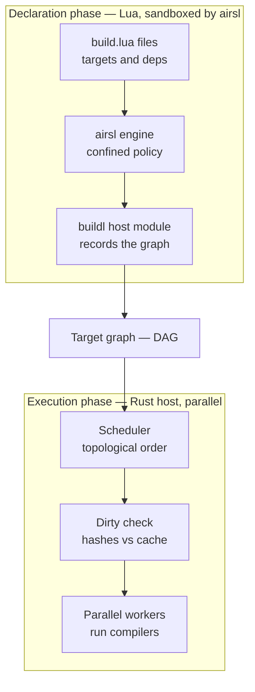

The line between the two subgraphs is airsl's boundary. Everything the declaration phase can do arrives through the `buildl` host module; everything dangerous happens in Rust, where the host controls parallelism, working directories, and output streaming — capabilities the Lua side deliberately does not have.

Consequences of the split:

- **Declaration is safe on untrusted input.** The declaration engine holds one grant (filesystem read on the workspace, for source globbing) and nothing else.
- **Parallelism lives where it works.** One Lua state cannot execute in parallel; a Rust worker pool can. Evaluation is the cheap front phase, execution the parallel back phase.
- **Resource ceilings become a feature.** A build file that loops forever is stopped by airsl's instruction ceiling in the declaration phase, before it can waste anyone's time.

## 3. Workspace layout and artifacts

buildl is delivered as a Cargo workspace of four crates: `crates/buildl-core` (domain data, ports, and the pure logic of every phase), `crates/buildl-lua` (the airsl adapter that evaluates build files), `crates/buildl` (the remaining adapters and the composition root), and `crates/buildl-cli` (the `buildl` binary). Their building blocks are in [`architecture-building-blocks.md`](./architecture-building-blocks.md). On disk in a user's project:

```text
myproject/
  buildl.toml          # workspace manifest: ceiling, approver, limits
  build.lua            # root build file (declaration only)
  src/...
  lib/
    build.lua          # per-directory build files
  .buildl/             # buildl state — gitignored
    graph.json         # last resolved DAG (sorted keys, diff-stable)
    cache.json         # action cache: target -> action key -> output digests
    cas/<sha256>       # content-addressed artifact store
    log.jsonl          # one JSON event per action
  out/                 # named outputs, linked from the cas
```

All metadata files use airsl's sorted-key JSON encoding, so they are byte-stable across runs and diff cleanly in review. The `cas` + action-cache pairing deliberately matches the model of the Remote Execution API, where a content-addressed store is keyed by SHA-256 digests and an action cache maps action keys to results [6][7] — see §10.

## 4. The workspace manifest: `buildl.toml`

Parsed by the Rust host before any Lua runs. It is the workspace owner's statement of maximum authority — the **ceiling** in airsl's extension-system vocabulary [1]:

```toml
[workspace]
name    = "myproject"
entry   = "build.lua"
out     = "out"
config  = 1                # buildl config version

[ceiling]                  # maximum authority any build may be granted
proc.run = ["cc", "ld", "go", "cargo", "bun", "docker", "protoc"]
env.read = ["HOME", "PATH", "GOCACHE", "CARGO_HOME"]
fs.read  = ["."]           # workspace-relative; expanded by the host, never by Lua
fs.write = ["out", ".buildl", "target"]

[approver]
default = "interactive"    # prompt on the first build of a fresh clone
ci      = "manifest"       # honour declarations silently when CI is detected

[declaration]              # ceilings for the Lua phase — it only declares
memory       = "16MB"
instructions = 10_000_000

[execution]
workers  = 0               # 0 = number of cores
timeout  = "10m"           # per action
strategy = "sandbox"       # bare | sandbox | os-sandbox | container (§11)
```

Two rules carried over from airsl's extension design deliberately: variables and relative roots are expanded **host-side** (a build file that could expand them could widen its own grant), and the ceiling can never be exceeded by anything a build file or plugin requests — requests are intersected with it, never unioned.

## 5. The Lua declaration API

Delivered as the **`buildl` module table**: one airsl `HostModule` whose table holds every helper a build file calls. The engine keeps airsl's default root table, so the curated host modules (§12.1) stay reachable as `airsstack.json`, `airsstack.path`, `airsstack.glob` and the rest, and the `buildl` module is installed beside them as `airsstack.buildl`. During installation the module also binds that same table to the global `buildl` — one table, two names — so build files write `buildl.target(...)` rather than `airsstack.buildl.target(...)`. The binding holds because airsl installs modules after it withholds unsafe globals and never locks the global table afterwards [1]. airsl's root-table validation does not cover a global a module binds, so keeping the name `buildl` clear of Lua's reserved words and standard globals is buildl's responsibility.

Every `build.lua` is evaluated with the `buildl` table already loaded. It begins as the declaration primitives below and is the framework surface everything later builds on: plugins (§10) arrive through `buildl.use`, and whatever a plugin generates is still these primitives.

```lua
-- build.lua (workspace root)
local b = buildl

b.subdir("lib")                          -- host evaluates lib/build.lua in its own scope

b.rule("cc", {
  run  = { "cc", "-c", "$in", "-o", "$out" },
  desc = "compile $in",
})

for _, src in ipairs(b.sources("src/**/*.c")) do
  b.target(airsstack.path.stem(src) .. ".o", { rule = "cc", inputs = { src } })
end

b.target("app", {
  deps = { "main.o", "util.o", "//lib:text" },   -- label syntax for cross-directory refs
  run  = { "cc", "$deps", "-o", "$out" },
})

b.alias("default", "app")
b.test("app_test", { deps = { "app" }, run = { "$out/app", "--self-test" } })
```

The design decisions in those lines:

- **Labels, not `require`.** Cross-directory references are graph names (`//lib:text`), resolved in Rust. airsl's confined `require` stops at the script's directory, and that is correct here: build files should not load each other's code, they should reference each other's _targets_. `b.subdir("dir")` asks the host to evaluate `dir/build.lua` in its own scope, so every declaration is namespaced by — and attributable to — the directory that made it.
- **Placeholders expand host-side.** `$in`, `$out`, `$deps` are substituted by the executor at run time, the ninja model [4]. Lua never holds a real artifact path.
- **`b.sources()` is the declaration phase's only filesystem read**, backed by the workspace-read grant. Results come back sorted (an airsl guarantee), so declaration is deterministic regardless of filesystem order.
- **`b.target` accepts a small closed table**: `rule` or inline `run`, `inputs`, `deps`, `outputs` (default: the target name), `env` (names checked against the ceiling), `network = true` (visible in `plan`, §11), and `always = true` for phony targets. Every field is an action-key component; the surface grows reluctantly.
- **`b.option(name, { default })` declares a build setting** — an invocation-time parameter with an explicit default, referenced in argv as `$opt:name` and overridden with `--set name=value`. Settings fold into the action key, so differently-parameterised runs cache separately and correctly (§10.2).

## 6. Grant negotiation: the DAG is the request

buildl needs no per-file capability manifest, because the build's authority is **derived, not requested**. After Resolve, the host walks the DAG and computes the _wanted set_ — every program in every `run`, every env name, every output root. That set flows through the same negotiation pipeline airsl's extension system defines [1]:

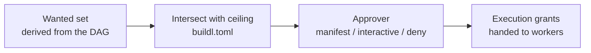

An extension's manifest is a promise; buildl's wanted set is derived truth. The negotiation happens between Resolve and Execute, which means the host can show a _precise_ prompt — "this build wants to run `cc`, `ld`, `docker`; allow?" — and a refusal happens at plan time, before anything runs, naming both the wanted and the granted set. Failure is closed: a wanted program outside the ceiling refuses the plan, never silently degrades the build.

## 7. The build workflow

Five phases with clean boundaries. Each CLI command is the pipeline truncated at a different point.

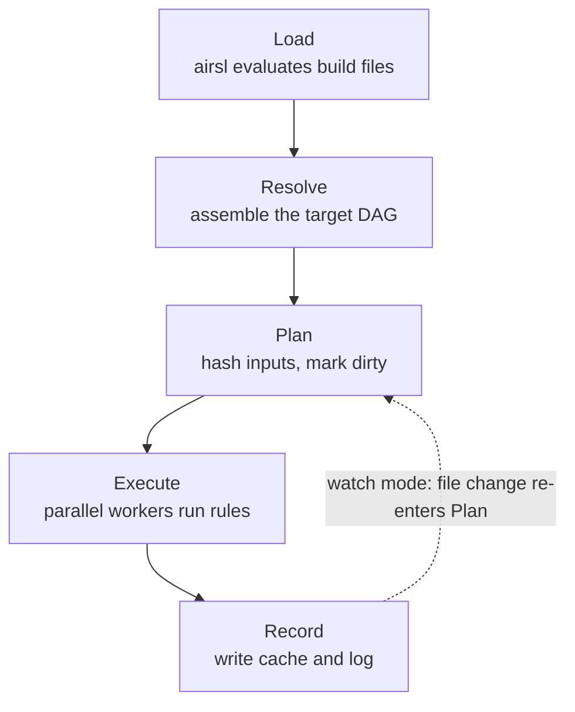

|Command|Stops after|Purpose|
|---|---|---|
|`buildl check`|Load|syntax-check every build file, run nothing|
|`buildl graph`|Resolve|emit the DAG (`--json`, `--dot`)|
|`buildl plan`|Plan|dry run: what would rebuild, and why|
|`buildl build [target]`|Record|the full pipeline|
|`buildl watch [target]`|loops|persistent process, re-plans on file change|
|`buildl test` / `clean` / `gc`|—|run test targets; drop outputs; prune the cas|
|`buildl query <expr>`|Resolve|graph queries: `deps()`, `rdeps()` (§10.1)|
|`buildl doctor`|—|print the effective ceiling, grants, workers|

Three workflow rules adopted deliberately:

1. **`plan` explains itself.** Dirtiness is hash-based, so "why did this rebuild" has a mechanical answer; it is surfaced from day one.
2. **Load and Resolve always run.** The graph is never cached across edits — only artifacts are. Build files are themselves inputs whose hashes invalidate their own targets, ninja's discipline [4].
3. **The log is an artifact.** `log.jsonl` records one sorted-key JSON object per action: target, command, hashes, duration, cache hit or miss.

## 8. Internal workflows

### 8.1 Load

A directory queue drives evaluation. Each build file gets a **fresh, disposable engine** (~136 µs [1]) so one file's stray globals cannot leak into the next — the same isolation decision airsl's own test runner made. The only surviving output is the staging list.

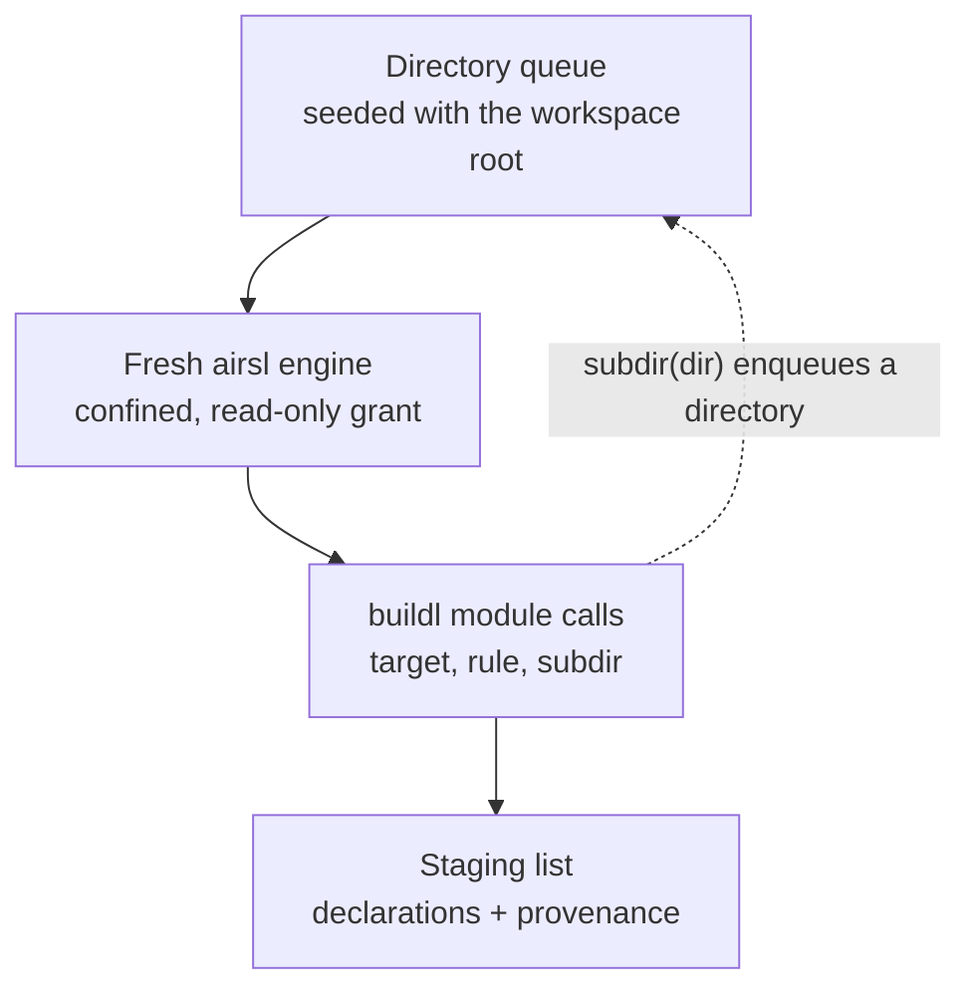

Every staged declaration carries provenance (the file that made it), which later phases use for attributable errors. Load parallelises across engines if needed — `Engine` is `Send + Sync` and each file has its own.

### 8.2 Resolve

Pure in-memory Rust: intern names namespaced by directory, resolve labels, then three validations that each fail with provenance — duplicates (both declaration sites named), unknown references (with a did-you-mean from the interned set), and cycles (the whole cycle path reported, not just its existence). Output: the DAG, including the reverse edges and per-node dependency counters the executor needs.

### 8.3 Plan: the action key

The core incremental mechanism, deliberately aligned with the Remote Execution API's action model [6][7]:

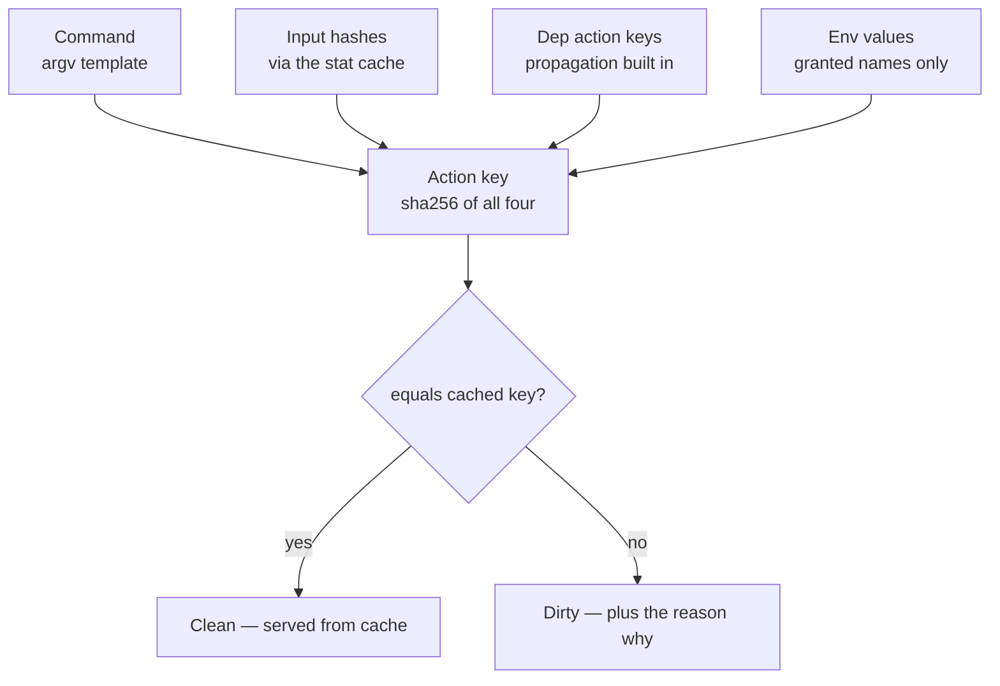

Because dep _keys_ fold into the hash, dirtiness propagates downstream with no separate marking pass. Two internals matter at scale: a **stat cache** (mtime + size unchanged since the last run means the recorded content hash is reused — the trick behind ninja-class no-op builds [4]), and parallel hashing, since files are independent. The mismatching component of the key is retained per dirty target — that is the entire implementation of `plan`'s explanations. The wanted-set ∩ ceiling check (§6) also runs here, so refusals precede execution.

### 8.4 Execute: the scheduler loop

A ready queue, a worker pool, and per-target dependency counters:

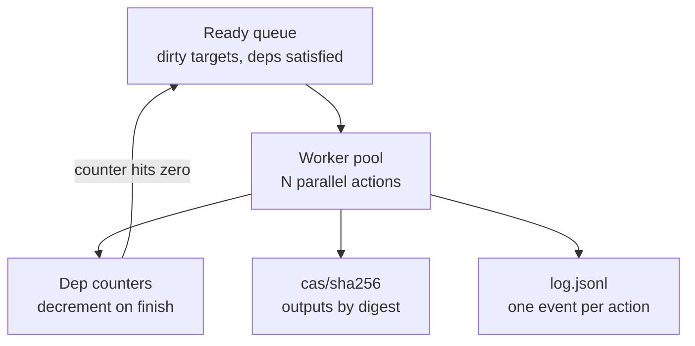

On failure, either stop scheduling new work (default) or continue with everything not downstream of the failure (`--keep-going`, for CI). Each worker's output is captured and printed as a block on completion, never interleaved. Scheduling order cannot leak into results: an action's inputs are declared and materialised before it starts, so its position in the schedule is unobservable to it.

### 8.5 One action's lifecycle — the crash-safety invariant

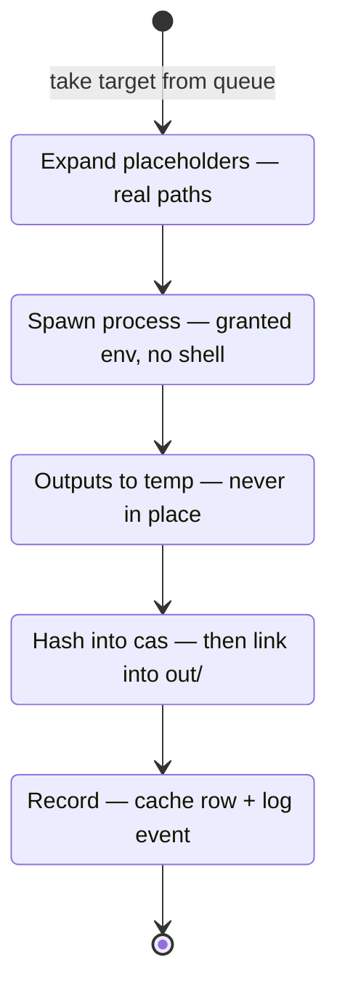

The ordering is the consistency story: **a cache row is written only after its outputs exist in the cas.** An interrupted build means some finished work is remembered and unfinished work is not; the next run re-plans and continues. No "corrupt cache, run clean" state is representable. The hash-into-cas step also yields early cutoff: a byte-identical rebuilt output leaves downstream action keys unchanged, so dependents stay clean.

### 8.6 Watch mode

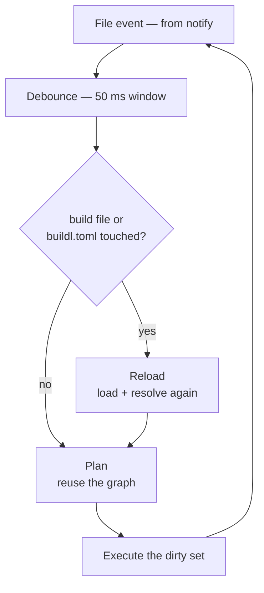

Events invalidate stat-cache entries for the touched paths. A changed build definition re-enters at Load (cheap — §8.1); a changed source file skips straight to Plan. Plain watch mode needs neither airsl's persistent-engine dispatch nor the extension `ext.on` machinery — full reload is fast enough to ship watch long before those exist.

### 8.7 Output capture and failure semantics

**Output.** Each worker captures stdout and stderr separately via pipes — the same shape airsl's `proc.run` returns (`stdout`, `stderr`, `status`) [1]. Output is printed as one block per action on completion, under a header naming the target — never interleaved across workers. It is also persisted: output blobs go into the cas by digest, referenced from the action's `log.jsonl` event. That enables `buildl log <target>` (show the last real output), keeps large outputs out of the JSON, and lets a cache hit replay the warnings from when the action actually ran — otherwise warnings vanish on every incremental build. A TTY gets a live status line with blocks as actions finish; CI gets plain sequential blocks; `--stream` attaches a single long action's output live.

**Failure classification.** The airsl principle — a resource breach is not a script failure — applied to builds. Three classes, distinguished structurally (exit status, timeout flag, refusal origin — never message text):

|Class|Meaning|Examples|
|---|---|---|
|Action failure|the build did its job by revealing it|compile error, test failure|
|Infrastructure failure|the builder is sick|missing tool, sandbox error, timeout|
|Policy refusal|the plan wants more than the ceiling|ungranted program or path|

Each class maps to a distinct process exit code, so CI distinguishes "fix your code" from "fix your builder" without parsing text.

**Failure containment.** A failure never cancels actions already running (their results land in the cas and are kept). By default no _new_ work is scheduled; `--keep-going` builds everything not downstream of the failure. Downstream targets are **skipped** — reported distinctly from failed, since they were never attempted: `1 failed, 2 skipped, 2 built`. The failure report carries the target label, the declaring file (provenance from Load), the post-expansion argv, the captured stderr, and the classification — all mirrored in `log.jsonl` for structured consumption.

**Failures are never cached.** The §8.5 invariant — a cache row is written only after outputs land in the cas — means a failed action leaves no row and the next run retries it. No cached-failure state exists, so no clean-build ritual is ever needed to un-stick a build. This is a deliberate departure from failure-caching systems: with deterministic inputs a retry costs one action, and flaky failures are exactly what should be re-run rather than remembered.

## 9. Worked examples

For Go, Rust, and Bun the compiler is itself an incremental build system; buildl wraps the whole invocation as one action and adds what those tools lack — cross-stack dependencies, a workspace-wide cache, declared authority.

### 9.1 Go

```lua
local b = buildl
local srcs = { b.sources("cmd/**/*.go"), b.sources("internal/**/*.go"),
               "go.mod", "go.sum" }          -- nested input lists flatten

b.target("server", { inputs = srcs, run = { "go", "build", "-o", "$out", "./cmd/server" } })
b.test("go_test",  { inputs = srcs, run = { "go", "test", "./..." } })
```

The action key covers every source plus the module files, so an untouched tree never spawns `go` — and because tests are cached by the same key, unchanged code skips its tests, with the log recording why.

### 9.2 TypeScript with Bun

```lua
b.target("deps", {
  inputs  = { "package.json", "bun.lock" },
  run     = { "bun", "install", "--frozen-lockfile" },
  outputs = { "node_modules/.buildl-stamp" },   -- stamp-file idiom for directory outputs
})
b.target("bundle", {
  deps   = { "deps" },
  inputs = { b.sources("src/**/*.ts"), "tsconfig.json" },
  run    = { "bun", "build", "src/index.ts", "--outdir", "$out", "--minify" },
})
```

`bun install` is keyed on the lockfile — editing a `.ts` file never reruns it. A directory-shaped output is represented by a stamp file: the lockfile already _is_ the tree's hash.

### 9.3 Rust

```lua
b.target("release", {
  inputs  = { "Cargo.toml", "Cargo.lock", b.sources("src/**/*.rs") },
  run     = { "cargo", "build", "--release", "--locked" },
  outputs = { "target/release/mytool" },
})
```

Cargo's `target/` stays cargo's cache (the ceiling grants `fs.write = ["target"]`): buildl decides _whether_ to invoke cargo, cargo decides how little to recompile. Two cache layers, each doing its own job.

### 9.4 Docker

```lua
b.target("api_image", {
  deps    = { "//services/api:server" },
  inputs  = { "Dockerfile.api" },
  run     = { "docker", "build", "-f", "Dockerfile.api", "--iidfile", "$out", "services/api" },
  outputs = { "api.iid" },
})
```

Docker's real output lives in the daemon, so the `--iidfile` (the image's content digest) is the artifact buildl hashes. Unchanged image → identical iid → downstream push/deploy targets stay clean.

### 9.5 A polyglot monorepo

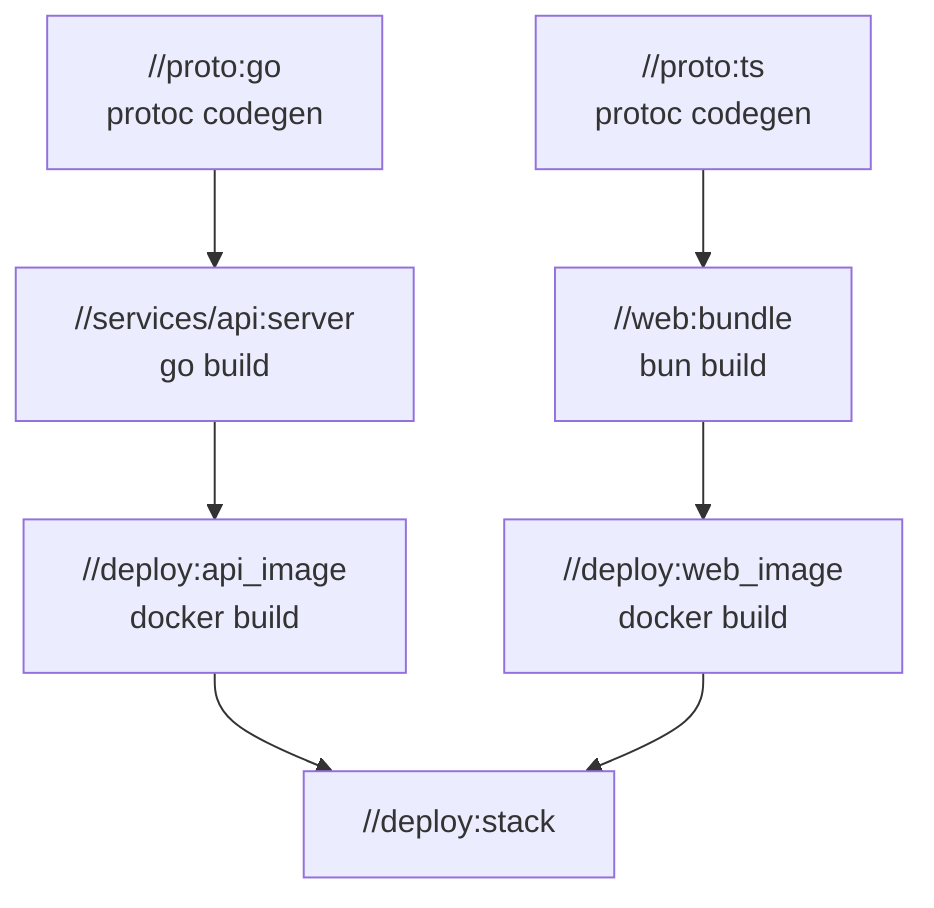

One `.proto` edit rebuilds both columns in the right order, the columns running in parallel; a web-only edit leaves the Go column cache-clean and `go` is never spawned. The workspace ceiling is five program names, and a contributed build file that adds a `curl` step is refused at plan time with both lists named. Every stack above used the same four primitives — `target`, `deps`, `inputs`, `run` — plus two idioms (stamp files, iidfile).

### 9.6 Toolchains: tools are dependencies too

An action's real dependency set is files, dep outputs, env values, **and the tools it runs**. buildl models tools at two levels, both expressed through the action key:

**Level 1 — observed tools (default).** `run = { "go", ... }` names the tool; the host resolves it on `PATH` at plan time (missing tool → plan refusal, naming the target and declaring file), fingerprints the resolved binary (content hash or version string), and folds the **tool fingerprint into the action key**. A toolchain upgrade dirties every affected target; machines with different versions never share cache entries. `buildl doctor` reports each ceiling program, its resolved path, and its fingerprint.

**Level 3 — hermetic toolchains (opt-in, via plugins).** A toolchain is an ordinary target:

```lua
-- toolchains/build.lua
b.fetch("go_sdk", {
  url    = "https://go.dev/dl/go1.22.5.linux-amd64.tar.gz",
  sha256 = "904b924d435eaea086515bc63235b192ea441bd8c9b198c507e85009e6e4c7f0",
})
b.target("go", { deps = { "go_sdk" }, run = { "tar", "-xzf", "$deps", "-C", "$out" } })

-- consuming action: the tool arrives as a dep
b.target("server", {
  deps   = { "//toolchains:go" },
  inputs = srcs,
  run    = { "$dep://toolchains:go/bin/go", "build", "-o", "$out", "./cmd/server" },
})
```

The SDK checksum flows through the dep chain into every downstream action key — version pinning by the same mechanism that pins everything else. Nothing need be installed on the host; remote workers receive the toolchain as they receive any input; onboarding is "install buildl".

`b.fetch` is the one primitive that needs network (a declared, plan-visible exception), and the checksum makes it deterministic despite the network: the download matches the pinned hash or the action fails. Content-addressing turns an impure operation into a pure one — the `http_archive` + `sha256` pattern [5].

Core buildl ships level 1 (zero-configuration day-one experience); plugins deliver level 3 as one line: `b.use("go", { toolchain = "1.22.5" })` makes the plugin declare the fetch, wire the dep, and rewrite the argv for every generated target.

## 10. Plugins

A buildl plugin is Lua that runs in the declaration phase — it cannot execute anything, so its entire power is generating primitives from intent. Structurally it is an airsl extension: manifest plus confined multi-file Lua [1].

```lua
-- usage
local go = buildl.use("go")
go.binary("server", { main = "./cmd/server", deps = { "//proto:go" } })
```

```toml
# plugins/go/plugin.toml
[plugin]
name = "go"
api  = 1
[capabilities]          # what my generated targets will want
proc.run = ["go"]
env.read = ["HOME", "PATH", "GOCACHE"]
```

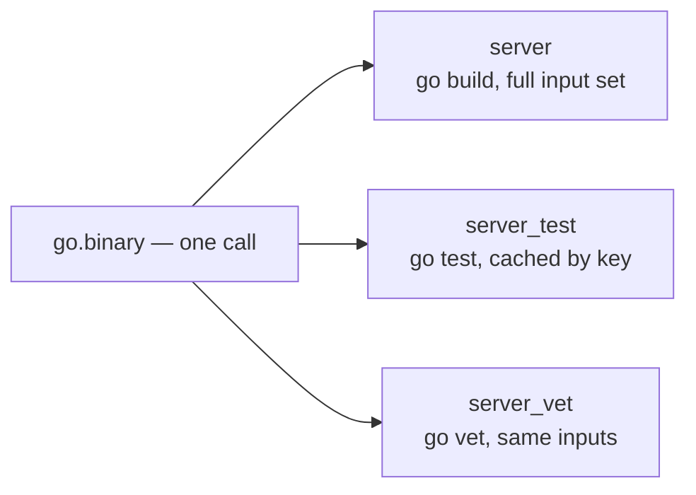

The manifest's capability block provides **attribution** (`plan` reports "wants go — declared by plugin <go@1.x> for //services/api:server") and **per-plugin narrowing** (a workspace may cap what each plugin can request; a compromised plugin update wanting `curl` is caught). Request ∩ plugin capability ∩ workspace ceiling — the extension host's intersection applied twice. Plugins need the manifest/ceiling/approver side of the airsl extension work but not the `ext.on` dispatcher.

**The one hard problem, decided now:** plugins must not execute tools at declaration time (`go list`, etc.) — that would run programs before any plan is shown. Declaration capability stays fs-read only. Genuine dynamic discovery uses a _discovery target_: an ordinary cached action whose JSON output a plugin consumes on the next declaration pass. Everything executed stays inside the granted, planned, cached world.

Downstream of any plugin, the system still speaks primitives: `buildl graph` shows exactly what a plugin declared, which is what makes third-party plugins inspectable.

### 10.1 Customization: three layers of engineer-owned logic

Plugins are a convenience layer, not a correctness layer — so custom logic has three homes, in increasing order of ownership:

**Options on plugin calls.** A plugin's option table is its customization API; the plugin maps options to argv, and since argv is in the action key, every variation caches separately and correctly:

```lua
go.test("auth_test", {
  packages = { "./internal/auth/..." },
  run      = "TestLogin|TestLogout",     -- go test -run filter
  tags     = { "integration" },
  timeout  = "2m",
})
```

**Dropping to primitives.** Plugins generate primitives; they never replace them. A case the plugin author did not anticipate is a raw `b.target` beside the generated ones — same graph, same caching, same grants. No one waits for a plugin release to express something.

```lua
b.target("fuzz_auth", {
  inputs = srcs,
  run = { "go", "test", "-fuzz", "FuzzParseToken", "-fuzztime", "30s", "./internal/auth" },
})
```

**Wrapping and composing.** A plugin is a Lua module returning functions, so a team writes a repo-local plugin encoding house rules on top of a public one — composition is function calls, and the manifest/attribution machinery applies to the wrapper like any plugin:

```lua
-- plugins/ourgo/plugin.lua
local go = buildl.use("go")
local M = {}
function M.service(name)
  go.binary(name, { main = "./cmd/" .. name })
  go.test(name .. "_unit", { packages = { "./internal/..." }, short = true })
  go.test(name .. "_integration", { tags = { "integration" }, network = true })
end
return M
```

### 10.2 Build settings: explicit invocation-time parameters

"Run only `TestLogin`, today" is a per-invocation choice, which is in tension with the explicitness principle (§12.4). The resolution is **build settings** — declared options with defaults, overridable per invocation:

```lua
b.option("test_filter", { default = "" })
go.test("go_test", { run = "$opt:test_filter" })
```

```bash
buildl test //services/api:go_test --set test_filter=TestLogin
```

The setting is declared (name and default visible in `buildl graph`), the override is visible in the invocation, and the value folds into the action key — a filtered run caches separately from a full run, and nothing enters the build that is not in the ledger. This is Bazel's build-settings idea [5] expressed through the one mechanism buildl already has.

A pattern that often dissolves the need for filters entirely: **per-unit target generation**. `go.tests_per_package()` is a Lua loop declaring one test target per package, so "run only the auth tests" becomes `buildl test //services/api:auth_test` — and package-granular targets mean `rdeps` runs only the tests a diff actually touches.

### 10.3 Stack plugins: what each one encodes

Each stack plugin is an idiom library — the encoded knowledge of how that toolchain wants to be wrapped. Sketches of the initial set:

**`go`** — `binary`, `test` (packages, run-filter, tags, short), `tests_per_package`, `vet`. Encodes: `go.mod`/`go.sum` in every input set, GOCACHE cooperation, optional hermetic SDK (§9.6). Use cases: service binaries, package-granular CI via `rdeps`, monorepo services sharing generated proto code.

**`bun`** — `deps` (lockfile-keyed install), `bundle`, `typecheck`, `test`, `lint`. Encodes: the stamp-file idiom for `node_modules`, frozen-lockfile discipline, parallel typecheck/bundle. Use cases: SPA bundles, server bundles, shared UI packages consumed across a monorepo.

**`rust`** — `build` (profile option), `test`, `clippy`, `fmt_check`, `doc`. Encodes: `Cargo.lock` + `--locked`, the two-cache-layer contract (buildl decides _whether_ cargo runs, cargo's `target/` decides how little to recompile), `fs.write = ["target"]` in the requested capabilities. Use cases: workspace crates, wasm artifacts feeding a web bundle.

**`docker`** — `image` (iidfile idiom), `push` (`network = true`, depends on the image), `run_in` (execute another target's action inside an image — the tier-4 bridge). Encodes: `--iidfile` digests as artifacts, `SOURCE_DATE_EPOCH`-aware BuildKit flags for reproducible layers [3] so users never learn they exist. Use cases: service images from compiled outputs, push-gated deploys, pinned build environments.

**`proto`** — `gen(languages)` declaring one codegen target per language from one `.proto` set. Encodes: the fan-out pattern of §9.5. Use case: the shared API contract feeding Go and TypeScript simultaneously — the canonical cross-stack edge no single-language tool can see.

**`python`** — `venv` (lockfile-keyed, the `deps` idiom again), `test` (pytest with a filter setting), `wheel`. Encodes: uv/pip-tools lockfile discipline, `.venv` stamp files. Use cases: ML pipelines and tooling scripts living beside compiled services.

The meta-observation the catalog exists to make: **the same few idioms recur across every stack** —

|Idiom|go|bun|rust|docker|python|
|---|---|---|---|---|---|
|Lockfile-keyed environment|`go.sum`|`bun.lock`|`Cargo.lock`|base image digest|`uv.lock`|
|Stamp file for directory outputs|—|`node_modules`|—|—|`.venv`|
|Digest file as artifact|—|—|—|`--iidfile`|—|
|Filter as build setting|`-run`|`--test-name-pattern`|`--test`|—|`-k`|
|Per-unit target generation|per package|per workspace pkg|per crate|per Dockerfile|per module|

A new stack plugin is mostly a matter of instantiating these five idioms for one more toolchain — which is why the plugin API surface can stay small and the core never needs to know a language exists.

## 11. Scale: big monorepos and remote execution

### 11.1 Big monorepos

- **Loading:** 10,000 build files × ~136 µs ≈ 1.4 s single-threaded, and Load parallelises across engines. Not the bottleneck.
- **Lazy loading falls out of labels:** `//services/api:server` encodes its own directory, so demand-driven loading (load only directories reachable from the requested targets, as Bazel does) is a traversal change, not a redesign. Start eager; flip when a repo makes it matter.
- **Reverse queries are the killer feature:** `buildl query "rdeps(//proto:go)"` maps a diff to the targets that must rebuild and the tests that must run. The reverse edges already exist for the executor; this is a CLI command over an existing structure, and it is worth more than remote execution to most teams.
- **No-op speed past ~100k files:** a filesystem watcher keeping the stat cache warm between runs — a merge of watch mode and the stat cache, both already designed.

### 11.2 Remote cache, then remote execution

Prerequisite for both — **local sandboxed execution** (§12): actions that read undeclared inputs must fail loudly on the developer's machine before any remote work exists, or they get wrongly cached [8][9].

Remote cache is the high-payoff step: the action key and cas are already REAPI-shaped [6][7], so sharing them is a service with two lookups:

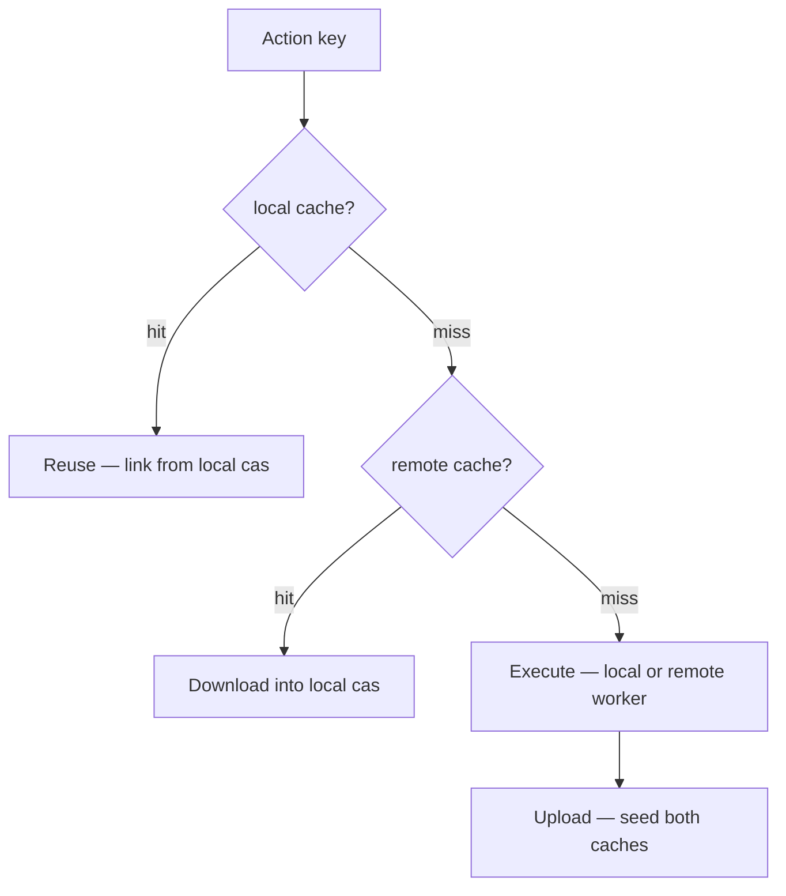

Typical deployment: CI builds `main` and seeds the cache; every developer's first build of the day is mostly downloads.

Remote execution adds workers on other machines:

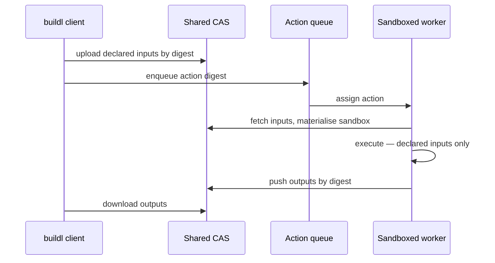

Two decisions: the **toolchain problem** — remote workers need the tools, so toolchains become declared inputs, pragmatically as a per-action container image whose digest joins the action key (the plugin layer declares it once); and **don't build the cluster** — speak the Remote Execution API as a client [7], and BuildBarn, Buildfarm, BuildBuddy, NativeLink become buildl's remote backends [8].

Nothing in this section touches Lua. Scale is a pure host-side concern — the two-phase split paying out again.

## 12. Isolation and determinism

### 12.1 Declaration phase: deterministic by construction

Two adjustments to airsl's `confined` preset close the remaining holes:

1. **Drop `os` and curate the module set.** `os.time`, `os.clock`, and Lua 5.4's entropy-seeded `math.random` are nondeterministic; the declaration policy uses a custom language surface without `os`, and a `ModuleSet` installing `json`, `path`, `regex`, `hash`, `glob` while omitting `time`, `proc`, `env`, `stdio`. airsl lets the host choose both — configuration, not new machinery [1].
2. **Canonicalise instead of forbidding `pairs`.** Lua table iteration order is unspecified, so the graph is made order-insensitive: keyed by names, sorted at Resolve, action keys order-independent. A `pairs` loop yields a byte-identical graph in any order.

Because declaration is cheap it is also _checkable_: evaluate twice, compare staging-list hashes; a nondeterministic build file fails `buildl check` with the diff.

### 12.2 Execution: isolation is a ladder

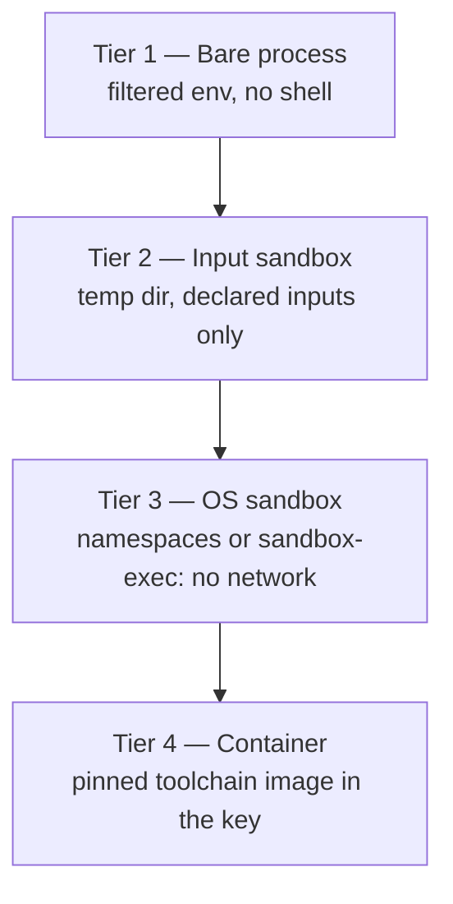

Tier 2 is Bazel's execroot discipline — undeclared inputs are simply absent, so hidden dependencies fail loudly [9]. Tier 3 seals network and system files. The strategy is set in `buildl.toml` with per-target overrides (`network = true` is a declared, plan-visible exception). Remote execution requires tier 2 or above. Parallel actions are isolated from each other by construction: own exec dir, own temp outputs, atomic landing in the cas.

### 12.3 Determinism: guarantee, mitigate, verify

|Property|Status|
|---|---|
|Same declared inputs → same action invoked|**guaranteed** — the action key|
|Action sees only declared inputs|**enforced** from tier 2 up|
|Hidden env, locale, timezone variation|**mitigated** — sandbox sets `TZ=UTC`, `LC_ALL=C`, `SOURCE_DATE_EPOCH` [3]|
|Network as a hidden input|**eliminated** at tier 3|
|Same action → byte-identical output|**the tool's property** — verified, not promised|

buildl cannot make a compiler reproducible; it can pin every input the compiler sees and verify the rest. `buildl verify` re-runs a sample of cache-hit actions and compares output digests — nondeterminism becomes a named, attributable defect instead of silent cache poisoning (which a shared remote cache would amplify). In practice Go is fully reproducible, rustc very nearly; `docker build` needs `SOURCE_DATE_EPOCH`-aware BuildKit flags [3], which the docker plugin passes so users never learn they exist.

### 12.4 The explicitness ledger

The governing principle: **every behavioral difference between two builds must be traceable to a difference in a declared input.** The action key is the ledger of what is explicit; the isolation tiers enforce that nothing outside the ledger can matter; `verify` audits the residue. The full ledger, and where each entry is handled:

|Input class|Made explicit by|
|---|---|
|Source files|`inputs`, content-hashed via the stat cache (§8.3)|
|Products of other targets|`deps` — their action keys fold in|
|Environment variables|granted names only; values in the key (§8.3)|
|Tools|fingerprint (level 1) or toolchain target (level 3, §9.6)|
|Host OS and CPU architecture|an `os/arch` pair in every action key — a mac and a Linux machine must never share entries|
|Network|absent by default (tier 3); `b.fetch` re-admits it behind a checksum; `network = true` is a plan-visible declaration|
|Time, locale, timezone|pinned by the sandbox: `SOURCE_DATE_EPOCH`, `LC_ALL=C`, `TZ=UTC` [3]|
|Build-file logic itself|build files are inputs; declaration is sandboxed, `os`-free, and double-run checkable (§12.1)|

What remains honestly implicit — the kernel version, libc, filesystem semantics, CPU microarchitecture as it affects codegen — is exactly the set that tier 4 (containers) and `verify` exist to contain. The ledger is finite and named; "surprise" is defined as any behavior difference not in it, and every such surprise is a bug in buildl, not in the user's build.

## 13. Sequencing

**Scope decision (2026-08-23): buildl is a build system first.** The defining capability is answering _"does this need to run at all?"_ — the action key, cas, and dirty check. Task-runner use (chores via `always = true`, alias-only graphs, cargo-make replacement) is a degenerate case the model yields for free and is explicitly not a v1 design driver. Nothing is designed _for_ it; nothing needs removing to allow it later.

**Scope decision (2026-09-13): fine-grained per-file C/C++ compilation is out of scope for v1.** The §5 per-`.o` pattern is unsound without dynamic input discovery, since the headers a compiler reads are never declared — traced in the walkthrough's §6. Every stack in §9 and every plugin in §10.3 wraps a toolchain that tracks its own internal dependencies, so no v1 use case needs the fine-grained shape. Where dynamic discovery _is_ needed, the mechanism is the **discovery target** (§10) — a cached action whose output a later declaration pass consumes — not a depfile side channel in the executor. The residual case discovery targets do not cover, per-action mid-execution discovery, extends their contract (§14) if it is ever required. No branch of this decision changes the Lua surface.

Dependency-ordered, with the airsl extension work interleaved:

1. **Core pipeline** — Load/Resolve/Plan/Execute/Record, `run`/`plan`/`graph`/`check`, local cache and cas. Needs only shipped airsl.
2. **`query` / `rdeps`** — small work, transforms CI for large repos.
3. **Local input sandbox (tier 2)** — the correctness discipline everything remote depends on.
4. **Grant negotiation UX** — wanted set, ceiling intersection, approver. Consumes the airsl extension host's ceiling + `Approver` (buildl is their first consumer; the manifest parser and `ext.on` dispatcher are not needed yet).
5. **Plugins** — manifest, attribution, `b.use()`. Consumes the extension manifest format.
6. **Remote cache via REAPI** — most of the remote value at a fraction of the complexity.
7. **Watch mode** — full-reload variant first; persistent-engine dispatch (`ext.on`) only if profiling demands it.
8. **Remote execution, toolchain containers** — when a repo has genuinely outgrown one machine.

## 14. Open questions

- **Label syntax details:** `//dir:target` adopted here; relative labels (`:sibling`), and whether `subdir` should be implicit via file discovery, are open.
- **Discovery targets** (§10): _partially resolved_ — `b.fetch` (§9.6) settles the most important case: an impure operation made pure by a pinned checksum. The general contract for feeding an arbitrary cached action's JSON output back into declaration (one extra pass vs a fixpoint) remains open.
- **Per-target grant narrowing:** the wanted set is currently workspace-granular; whether individual targets should carry narrower grants (defense in depth at tier 3+) is open.
- **`buildl.toml` vs declaration in Lua:** the ceiling must stay in inert TOML (it gates the Lua). How much of `[execution]` belongs there versus in the root build file is taste.
- **API versioning for plugins:** same decision airsl's extension doc flags — additive-only within `api = 1`, or looser; must be decided before the first third-party plugin ships [1].

## References

1. airsstack. _airsl — Embeddable Lua runtime with a host standard library_ (source, docs: architecture.md, sandbox.md, extensions.md). GitHub, 2026. URL: [https://github.com/airsstack/airsl](https://github.com/airsstack/airsl)
2. airsstack. _airsl crate_. crates.io, 2026. URL: [https://crates.io/crates/airsl](https://crates.io/crates/airsl)
3. Reproducible Builds project. _SOURCE_DATE_EPOCH specification_. reproducible-builds.org. URL: [https://reproducible-builds.org/specs/source-date-epoch/](https://reproducible-builds.org/specs/source-date-epoch/)
4. Evan Martin et al. _The Ninja build system — manual_. ninja-build.org. URL: [https://ninja-build.org/manual.html](https://ninja-build.org/manual.html)
5. Google / Bazel authors. _Hermeticity_. bazel.build. URL: [https://bazel.build/basics/hermeticity](https://bazel.build/basics/hermeticity)
6. BuildBuddy. _Bazel's Remote Caching and Remote Execution Explained_. buildbuddy.io. URL: [https://www.buildbuddy.io/blog/bazels-remote-caching-and-remote-execution-explained/](https://www.buildbuddy.io/blog/bazels-remote-caching-and-remote-execution-explained/)
7. Bazel authors. _remote-apis — An API for caching and execution of actions on a remote system_. GitHub. URL: [https://github.com/bazelbuild/remote-apis](https://github.com/bazelbuild/remote-apis)
8. Buchgr et al. _bazel-remote — a remote cache for REAPI clients_. GitHub. URL: [https://github.com/buchgr/bazel-remote](https://github.com/buchgr/bazel-remote)
9. Google / Bazel authors. _Sandboxing_. bazel.build. URL: [https://bazel.build/docs/sandboxing](https://bazel.build/docs/sandboxing)
10. xmake-io. _Xmake — a cross-platform build utility based on Lua_. xmake.io. URL: [https://xmake.io/](https://xmake.io/)
11. khvzak et al. _mlua — high-level Lua bindings for Rust_. crates.io. URL: [https://crates.io/crates/mlua](https://crates.io/crates/mlua)
