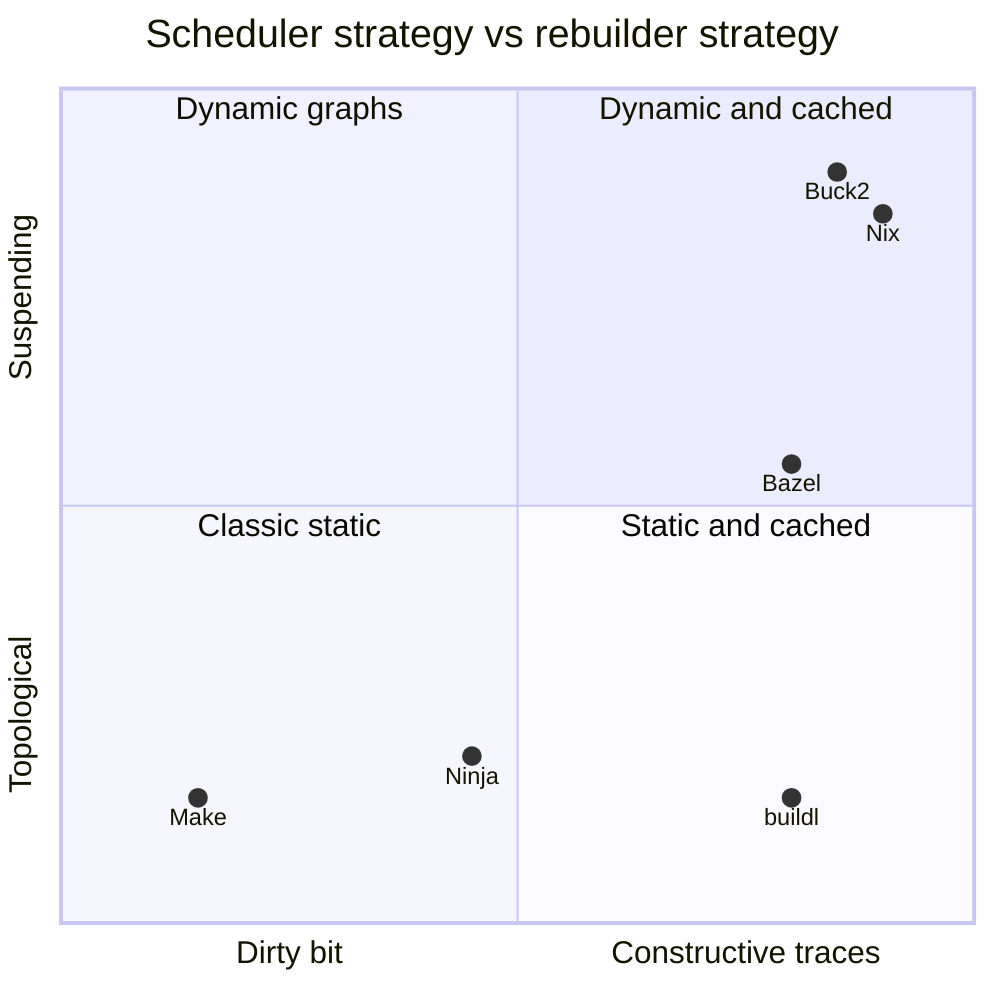
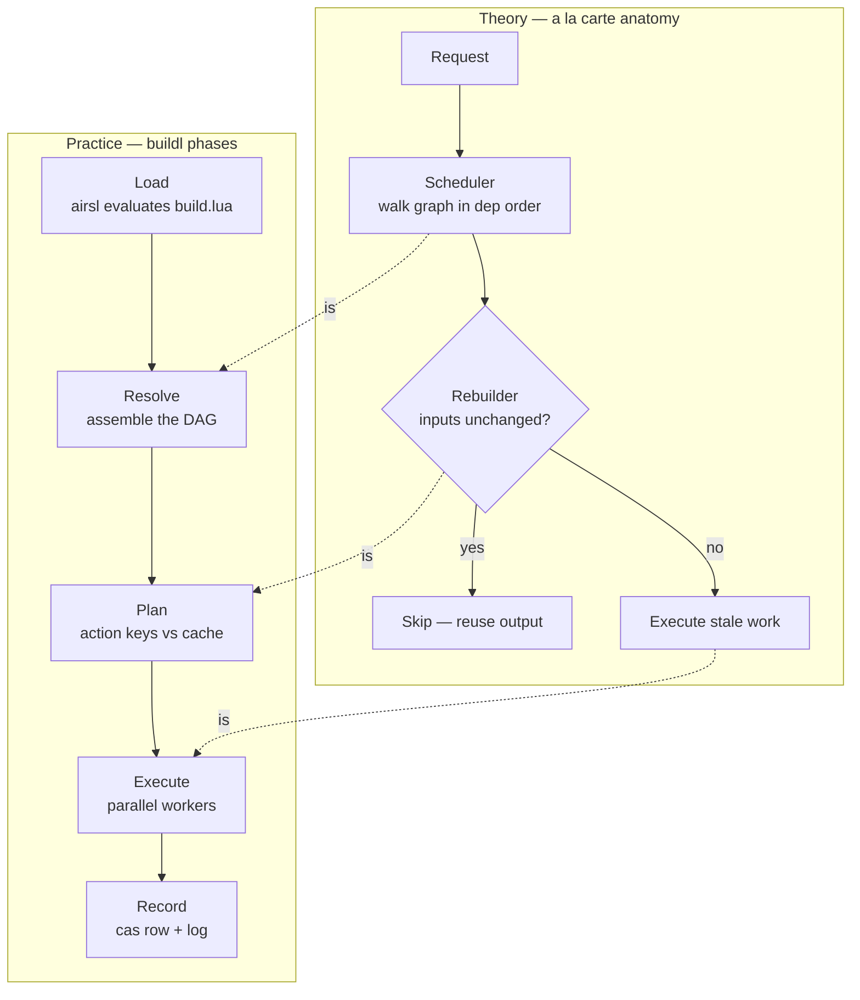
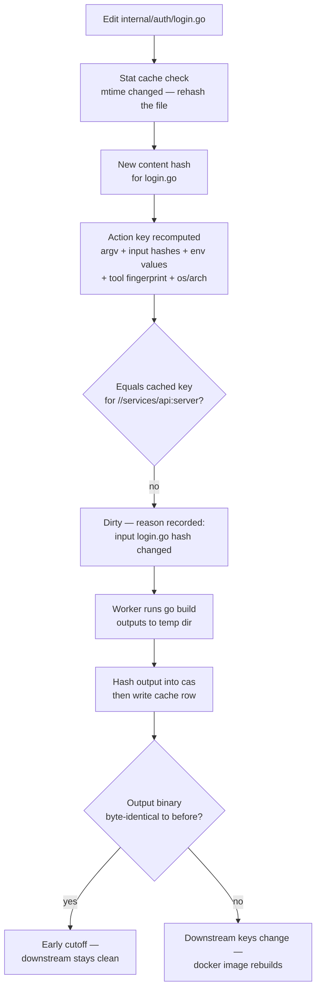
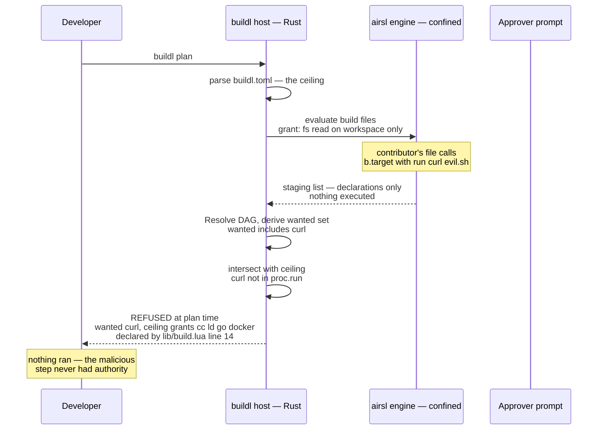
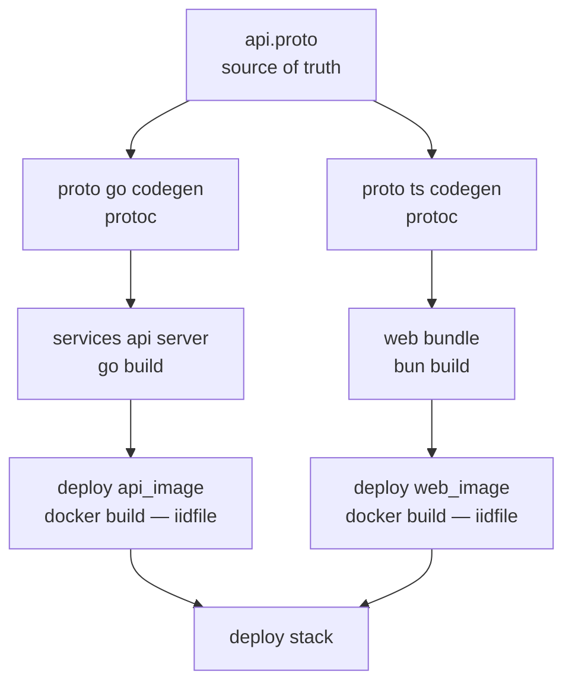
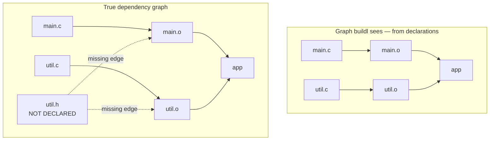
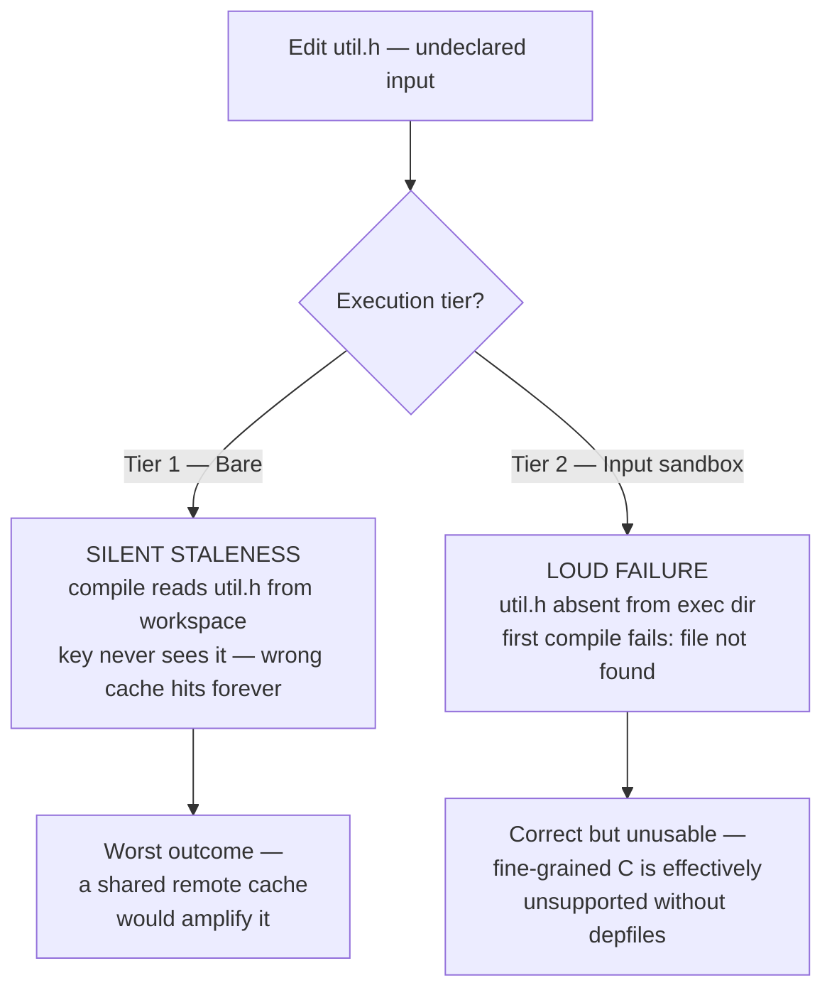
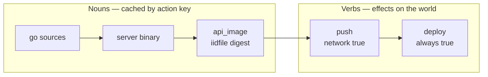
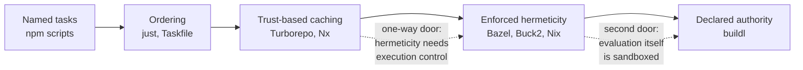
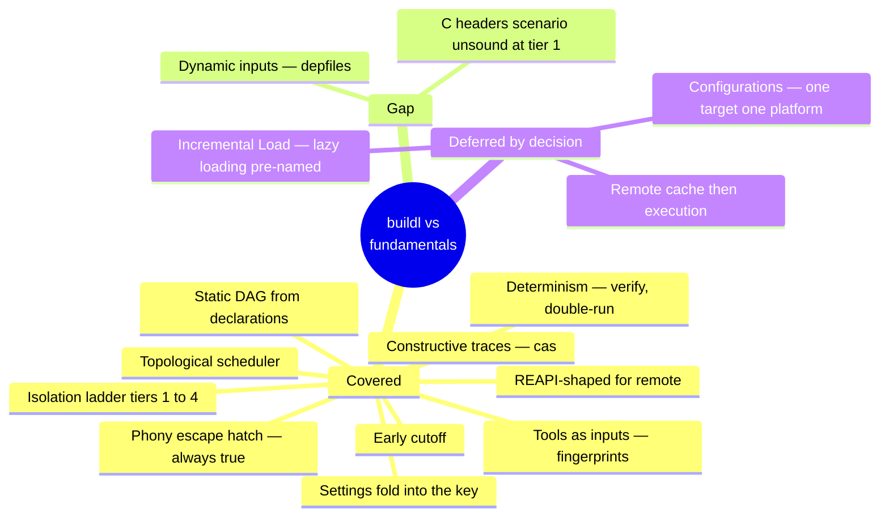

# buildl Against the Fundamentals — a Visual Walkthrough

A companion study document to _Build System Fundamentals_ and _Task Runner Fundamentals_ [1][2]. It maps the `buildl` design and architecture specs onto the theory, diagram by diagram, with concrete scenarios traced end to end. Each section pairs one fundamental concept with the exact buildl mechanism that implements it — and the one place where the mapping breaks.

---

## 1. Where buildl Sits in the à la Carte Taxonomy

_Build Systems à la Carte_ decomposes every build system into a **scheduler** (what order) and a **rebuilder** (run at all?) [3]. buildl occupies a precise cell in that grid.



buildl is a **topological scheduler with constructive traces**: the graph is fully known after Resolve, walked bottom-up, and every action's output is stored in a content-addressed store keyed by its action key. That is the same rebuilder as Bazel, paired with the simpler scheduler of Make and Ninja — a deliberate combination, because buildl's declaration phase produces a complete static graph, so the more complex suspending/restarting schedulers buy nothing. The taxonomy also predicts buildl's one gap (§6): a purely topological scheduler cannot handle dependencies discovered _during_ execution.

The dimension the grid cannot show is buildl's actual signature: **authority is derived from the graph, not assumed from the host**. No surveyed tool has that axis.

---

## 2. The Anatomy Diagram: Scheduler + Rebuilder Made Literal

The fundamentals describe a build system as a pipeline: request → scheduler → rebuilder → execute-or-skip [1][3]. buildl's five phases are that pipeline with the phase boundaries turned into serializable values.



The mapping is exact: Resolve builds what the scheduler walks, Plan _is_ the rebuilder (the action-key comparison), Execute runs only the dirty set. What buildl adds beyond the theory is that each arrow between phases is a value (`Vec<Declaration>` → `TargetGraph` → `Plan` → `Vec<ActionOutcome>`), which is why `buildl graph` and `buildl plan` exist for free — each CLI command is the pipeline truncated at one handoff.

---

## 3. The Action Key: One Concrete Trace

The rebuilder's entire intelligence is the action key. The fundamentals describe it abstractly — "hash of inputs + command + environment + toolchain" [1]. Here is one concrete trace through a Go service target.

```lua
-- services/api/build.lua
local srcs = { b.sources("cmd/**/*.go"), b.sources("internal/**/*.go"),
               "go.mod", "go.sum" }
b.target("server", { inputs = srcs, run = { "go", "build", "-o", "$out", "./cmd/server" } })
```

**Scenario:** you edit `internal/auth/login.go` and run `buildl build server`.



Every box corresponds to a named mechanism in the specs: the stat cache (design §8.3), the key components ledger (design §12.4), the cas-first crash-safety invariant (design §8.5), and early cutoff falling out of hashing outputs into the cas. The `plan` command's "why dirty" explanation is nothing more than the diff of the key components — which is why the architecture keeps `KeyComponents` alongside the digest instead of discarding them.

**Three follow-on scenarios, same target:**

|You do this|buildl does this|Because|
|---|---|---|
|Edit a comment in `login.go`, `go build` output is byte-identical|Runs `go build` once, then everything downstream is skipped|Early cutoff: output hash unchanged → dependent keys unchanged|
|Upgrade the Go toolchain, touch nothing|Rebuilds `server` and everything downstream|Tool fingerprint is a key component; a new `go` binary is a new key|
|Run the same build on a colleague's Mac|Full rebuild, no cache sharing|`os/arch` is in every key — a Mac and a Linux machine must never share entries|

---

## 4. Use Case: Untrusted Clone — the Differentiator in Action

The fundamentals treat hermeticity as a property of _execution_ [4]. buildl extends the same instinct to _evaluation_: a cloned repo's build files can be evaluated before any trust decision, because evaluation grants nothing. This is the scenario no tool in either fundamentals document can run safely.

**Scenario:** you clone a contributor's fork of your monorepo. Their PR adds a build file. You run `buildl plan`.



Two properties of the fundamentals combine here in a way neither document anticipates: the **restricted configuration language** lesson ("the less expressive the language, the more the tool can reason about it" [1]) and **hermeticity** — but applied at declaration time. Bazel's Starlark cannot do I/O, but Bazel's `BUILD` evaluation still happens with the tool's ambient authority; buildl's evaluation happens with a single explicit grant. The wanted set is derived truth, not a manifest's promise, so the refusal message can name both sides precisely.

---

## 5. Use Case: the Polyglot Monorepo Ripple

The canonical build-system use case — cross-stack dependencies no single-language tool can see. This is design §9.5 traced through two different edits.



**Edit 1 — change `api.proto`.** Both codegen keys change → both columns dirty → Go and Bun columns rebuild _in parallel_ (no path between them), then the two docker images, then the stack. One edit, correct order, maximal parallelism, and if the regenerated Go code happens to be byte-identical (a comment-only proto change), early cutoff stops the ripple at `PG`.

**Edit 2 — change `web/src/App.ts`.** Only `WEB`'s key changes. The entire Go column is cache-clean — **`go` is never spawned**. The build's spawn list is itself evidence of the graph's correctness.

**Edit 3 — a diff lands in CI.** `buildl query "rdeps(//proto:go)"` answers "which targets and tests does this diff touch" — the reverse edges the executor already maintains, exposed as a query. For a large repo this transforms CI cost more than remote execution does, which is why the sequencing plan (design §13) puts `query` second.

---

## 6. The Gap, Visualized: the Depfile Problem

The one fundamental buildl does not yet cover: **dynamic input discovery** — Ninja's depfiles, where the compiler reports the headers it actually read [5]. The design doc's own §5 example demonstrates the hole.

```lua
-- design.md section 5 — per-file C compilation
b.target(b.path.stem(src) .. ".o", { rule = "cc", inputs = { src } })
```



**Scenario:** edit `util.h`, run `buildl build app`. No declared input changed, so every action key matches the cache — **buildl reports all clean and serves a stale binary**. The behavior depends on the isolation tier:



Tier 2 converts the correctness bug into a loud failure — the sandbox doing exactly its job [4] — but that only proves fine-grained C/C++ cannot be expressed, not that it works. The worked examples in design §9 avoid the problem by wrapping whole self-tracking toolchains (`go build ./...`, `cargo build`) with full source globs, which is sound. The resolution to record before development: either declare fine-grained C compilation out of scope for v1, or add Ninja-style depfile support — the executor parses the compiler's `.d` output, records _observed_ inputs beside the cache row, and folds them into the next run's key [5]. The depfile option is host-side only; the Lua surface never changes.

---

## 7. The Degenerate Case: buildl as Task Runner

The task-runner fundamentals establish that a build system contains a task runner, reachable through escape hatches [2]. buildl's escape hatch is `always = true`, and the verbs-calling-nouns layering from that document collapses into a single graph.

```lua
b.target("push", {
  deps = { "api_image" },
  run = { "docker", "push", "registry.example.com/api" },
  network = true,           -- declared, plan-visible exception
})
b.target("deploy", { deps = { "push" }, run = { "kubectl", "apply", "-f", "k8s/" },
  always = true })          -- a verb: never cached, never skipped
```



The interesting middle node is `push`: it is a _cached side effect_, and that is correct here — an unchanged image digest means the registry already has these bytes, so skipping the push is the desired behavior, not the "deploy is up to date while production burns" disaster the task-runner document warns about [2]. `deploy` is the true verb and carries `always = true`. The classification test from that document ("ask the tool to do the same thing twice") gives the right answer at every node: nouns no-op, `push` no-ops when the digest matches, `deploy` runs every time.

This is also why the state machine's summary line matters: `1 failed, 2 skipped, 9 cached, 2 built` distinguishes states a pure task runner cannot represent — `Cached` and `Skipped` are the rebuilder's vocabulary.

---

## 8. The Capability Gradient, with buildl Placed

The task-runner document's gradient — names → ordering → caching → hermeticity — with the one-way door marked [2].



Turborepo's cache is only as correct as your declarations; Bazel enforces the declarations with sandboxing at execution time; buildl adds a step the gradient did not have — the _configuration language itself_ runs inside the enforcement boundary, and the build's total authority is derived from the graph and checked against a ceiling before anything runs. Each step right costs adoption effort; buildl's bet is that starting from declared authority (inherited from airsl) makes the last step cheaper than retrofitting it.

---

## 9. Summary Card



One sentence per branch: everything the two fundamentals documents name as load-bearing exists in the specs as a concrete mechanism; the single pre-development blocker is deciding the depfile question, because it is a correctness property, not a feature; and the deferred items all have pre-named fallbacks, which is what makes them reversible.

---

## References

1. _Build System Fundamentals_ (uploaded study document), synthesizing Mokhov, Mitchell, Peyton Jones et al.
2. _Task Runner Fundamentals_ (uploaded study document).
3. Andrey Mokhov, Neil Mitchell, Simon Peyton Jones. _Build Systems à la Carte_. Microsoft Research / ICFP, 2018. URL: <https://www.microsoft.com/en-us/research/uploads/prod/2018/03/build-systems.pdf>
4. Google / Bazel authors. _Hermeticity_ and _Sandboxing_. bazel.build. URL: <https://bazel.build/basics/hermeticity>
5. Evan Martin et al. _The Ninja build system — manual_ (depfiles, restat). ninja-build.org. URL: <https://ninja-build.org/manual.html>
6. Bazel authors. _remote-apis — An API for caching and execution of actions on a remote system_. GitHub. URL: <https://github.com/bazelbuild/remote-apis>
7. airsstack. _buildl design and architecture specs_ (project documents: design.md, architecture.md), 2026.
