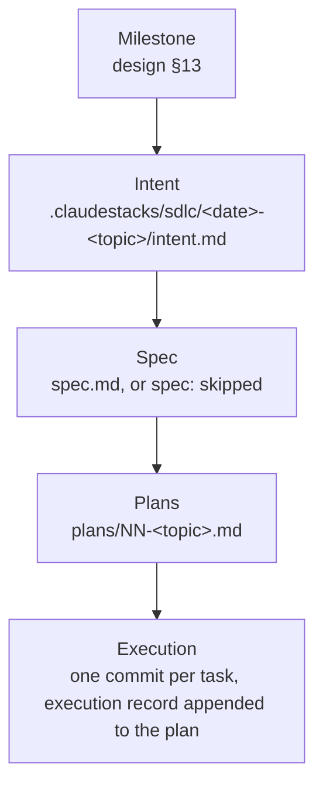
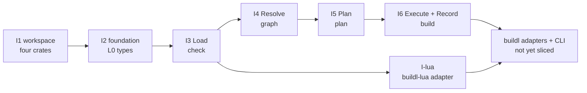

# buildl — development roadmap

**Status: living document.** Companion to [`design.md`](./design.md), [`architecture.md`](./architecture.md) and [`architecture-building-blocks.md`](./architecture-building-blocks.md). `design.md` §13 fixes _what ships in which order_; this document tracks _how that order is being built_: the milestone ladder, the intent slices that break the first milestone into reviewable units of work, each slice's status, and the follow-ups that earlier slices handed to later ones. Update it whenever a chain changes state.

**Author:** rstlix0x0 · **Date:** 2026-09-15 · **Reviewers:** —

---

## 1. How the roadmap is organised

Work has two levels. **Milestones** are the product sequence settled in design §13. **Intents** are the units of development: each one is a claudestacks-sdlc chain [1] under `.claudestacks/sdlc/<date>-<topic>/`, taken through intent → spec → plans → execution. A milestone is done when the intents that break it down are done.

|Artifact|States|Moves when|
|---|---|---|
|`intent.md`|draft → approved → done (or dropped)|approved by the author; done once every plan in the chain is done|
|`spec.md`|draft → approved (or superseded)|approved by the author after one review round|
|`plans/NN-*.md`|draft → approved → executing → done (or superseded)|approved by the author; executing when task 1 starts; done once the author accepts the completion report|

Only milestone 1 is broken into intents so far. Later milestones get intents when milestone 1 is close to done.

## 2. Milestones

The order and rationale are in design §13; this table adds status only.

|#|Milestone|Status|
|---|---|---|
|1|**Core pipeline**: Load/Resolve/Plan/Execute/Record, the `check`/`graph`/`plan`/`build` commands, local cache and cas|**in progress** (§3)|
|2|**`query` / `rdeps`**|not started|
|3|**Local input sandbox (tier 2)**|not started|
|4|**Grant negotiation UX**: wanted set, ceiling intersection, approver|not started|
|5|**Plugins**: manifest, attribution, `b.use()`|not started|
|6|**Remote cache via REAPI**|not started|
|7|**Watch mode**|not started|
|8|**Remote execution, toolchain containers**|not started|

## 3. Milestone 1 — the intent ladder

Milestone 1 is cut along the pipeline's handoffs (architecture-building-blocks §5.4). Every phase's logic lands in `buildl-core` against fake ports first. The Lua adapter follows once its port exists. Each slice after I2 ends at a command's handoff, so every slice leaves the pipeline runnable up to a new point.

|Intent|Crate|Scope|Done when|Status|
|---|---|---|---|---|
|**I1 workspace**|all|Create `buildl-core` and `buildl-lua`; wire the §7 dependency graph (core ← lua ← buildl ← cli); airsl requirement `0.1`; toolchain `stable`, `rust-version` 1.94; remove stale scaffold wording|`cargo make dod` and `cargo deny check` pass; crate edges match architecture-building-blocks §7|**done**, 2026-09-15 (§4)|
|**I2 foundation**|`buildl-core`|`Label`, `Digest`, `NodeId`, `Provenance`, `Timestamp`; the error model; the canonical JSON serializer; the `Clock` port|unit tests pass; no I/O|not started|
|**I3 Load**|`buildl-core`|`Declaration`, `BuildFile`, `StagedFile`, `DeclarationSource`; the `Pipeline` skeleton and `FakePorts`|a fake source's output becomes `Vec<Declaration>`|not started|
|**I-lua**|`buildl-lua`|`DeclarationSource` on airsl; the `buildl` table bound to both `airsstack.buildl` and the `buildl` global (design §5)|`build.lua` fixtures produce exact declarations|not started|
|**I4 Resolve**|`buildl-core`|the `TargetGraph` arena, label resolution, cycle detection, grants (wanted set ∩ ceiling)|the pipeline stops at `graph`|not started|
|**I5 Plan**|`buildl-core`|the action key, `KeyComponents`, why-dirty; the digest, stat, tool and cache-read ports|the pipeline stops at `plan`|not started|
|**I6 Execute + Record**|`buildl-core`|`Schedule`, `Dispatcher`, `ExecStrategy`; cas, cache and log writes; the crash-safety invariant (design §8.5)|a full `build` runs against fakes|not started|

Ground rules for the ladder:

- **`Pipeline<P: Ports>` and `FakePorts` start in I3**, and every later slice extends them (architecture-building-blocks §5.3, §8).
- **The port assignment above is a first guess.** Each slice's spec settles which ports it introduces.
- **Adapters in `buildl` and the CLI come after I6** and are not sliced yet: `LocalPorts`, the storage, exec, digest and manifest adapters (architecture-building-blocks §6), and argument parsing in `buildl-cli`.
- **Publishing is out of scope** until the adapters exist. The publish order stays as documented in architecture-building-blocks §9.
- **airsl stays on the `0.1` series.** Moving to `0.2` is a breaking change and gets its own decision.

## 4. Completed intents

|Intent|Chain|Plans|Commits|
|---|---|---|---|
|I1 workspace|`.claudestacks/sdlc/2026-09-13-workspace-crates/`|`01-workspace-crates` (8 tasks)|`0a8817f` … `3e462d5`|

The plan file's `## Review findings`, `## Probe results` and `## Deviations` sections hold the full execution record. §5 lists the follow-ups from that record that are still open.

## 5. Carried follow-ups

Findings an earlier slice recorded but left out of scope, each assigned to the slice expected to close it. When a slice's intent is written, pull in the rows assigned to it.

|#|Follow-up|Origin|Target|
|---|---|---|---|
|1|Guard the crate edges: a `deny.toml` ban such as `deny = [{ crate = "airsl", wrappers = ["buildl-lua"] }]`, plus a per-crate `cargo tree --depth 1` check. Today, deleting `buildl`'s dependency edges still passes `cargo make dod`.|I1 review|I2|
|2|Enforce "no filesystem, process, thread, environment or clock API" in `buildl-core`, for example with a clippy `disallowed-methods` / `disallowed-types` config.|I1 review|I2|
|3|Refresh the crate-level docs once real modules exist: port lists that omit `Clock`, `Manifest`/`Approver`, `Reporter`, `StatCache`/`ToolResolver` and `Dispatcher`; "holds only module declarations and re-exports" in `lib.rs` files that hold neither; `buildl`'s adapter list, which disagrees between its README and `lib.rs`.|I1 review|each crate's first code slice (I2, I-lua, adapters)|
|4|Raise the airsl floor above `0.1.0` when the first airsl call lands. No minimal-versions check exists.|I1 review|I-lua|
|5|The `buildl-cli` `description` says "a thin clap shell", but clap is not yet a dependency.|I1 review|CLI slice|
|6|Tooling comment accuracy: `Cargo.toml` cites `architecture.md` §5.2, which does not exist; the §6 citation for storage adapters is narrower than the one it replaced; `deny.toml` says every member "is published" and that the `skip` list "freezes" the current state while `skip = []`.|I1 review|unassigned, docs sweep|
|7|architecture-building-blocks §7 rule 2 ("adapters depend on `buildl-core` only") and §4's lead sentence ("no adapter depends on another") conflict with the `buildl → buildl-lua` edge that the §4 crate table lists.|I1 review|unassigned, docs sweep|
|8|design §13 names the milestone 1 commands `run`/`plan`/`graph`/`check`; design's command table and `architecture.md` name the full pipeline `build`.|roadmap write-up|unassigned, docs sweep|
|9|`rust-version` 1.94 is never built: CI runs only on stable, with no MSRV job.|I1 review|unassigned|
|10|CI's `rustup toolchain install` with no argument needs rustup 1.28 or newer on the runners. This is not yet verified.|I1 review|first CI run on a pushed branch|

## 6. Process notes

|Topic|Practice|
|---|---|
|Where work happens|a git worktree on its own branch, never `main`|
|Commits|Conventional Commits, `type(scope): summary`; scope is the crate name, or `repo` for cross-cutting changes; one commit per plan task|
|Gates|`cargo make dod` (fmt, clippy `-D warnings`, doc `-D warnings`, tests, doctests) and `cargo deny check`, both green before each commit|
|Review|one reviewer pass per batch of tasks and one fix round; a disproven plan premise is amended in the plan, not only in the code|
|Known tooling gap|`handoff.lua init` is refused under worktree isolation because it runs `airsl run … --allow-exec git`. Until claudestacks issue #6 [2] is fixed, runs use a session-scratch handoff directory and record that as a deviation.|

## References

1. airsstack. _claudestacks — Stacks working with Claude Code, including plugin and custom tools_ (the `claudestacks-sdlc` plugin and its artifact chain). GitHub, 2026. URL: [https://github.com/airsstack/claudestacks](https://github.com/airsstack/claudestacks)
2. airsstack. _handoff.lua init is refused in worktree-isolated Claude Code sessions (--allow-exec git)_ (claudestacks issue #6). GitHub, 2026. URL: [https://github.com/airsstack/claudestacks/issues/6](https://github.com/airsstack/claudestacks/issues/6)
