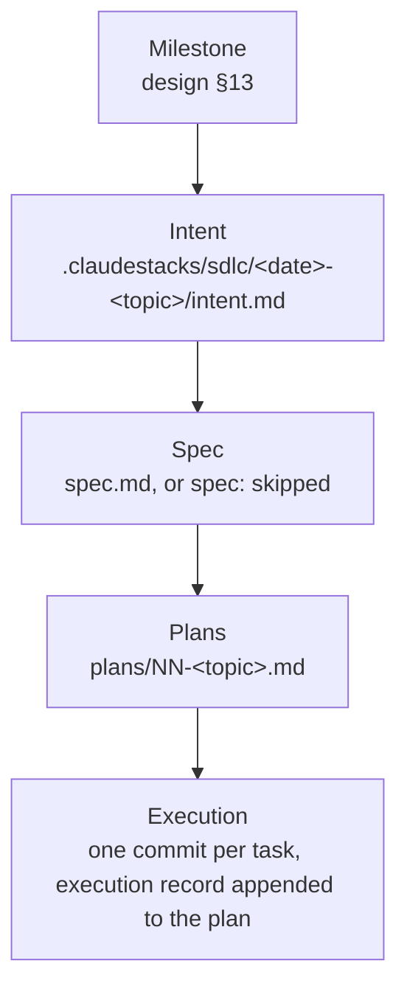
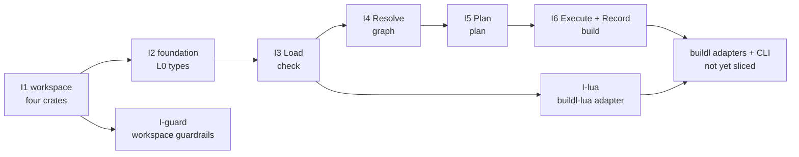

# buildl — development roadmap

**Status: living document.** Companion to [`design.md`](./design.md), [`architecture.md`](./architecture.md) and [`architecture-building-blocks.md`](./architecture-building-blocks.md). `design.md` §13 fixes _what ships in which order_; this document tracks _how that order is being built_: the milestone ladder, the intent slices that break the first milestone into reviewable units of work, each slice's status, and the follow-ups that earlier slices handed to later ones. Update it whenever a chain changes state.

**Author:** rstlix0x0 · **Date:** 2026-09-15 · **Reviewers:** —

---

## 1. How the roadmap is organised

Work has two levels. **Milestones** are the product sequence settled in design §13. **Intents** are the units of development: each one is a claudestacks-sdlc chain [1] under `.claudestacks/sdlc/<date>-<topic>/`, taken through intent → spec → plans → execution. A milestone is done when the intents that break it down are done.

```mermaid
%% Two levels — milestones (design §13) decompose into intent chains
graph TD
    M["Milestone<br/>design §13"] --> I["Intent<br/>.claudestacks/sdlc/&lt;date&gt;-&lt;topic&gt;/intent.md"]
    I --> S["Spec<br/>spec.md, or spec: skipped"]
    S --> P["Plans<br/>plans/NN-&lt;topic&gt;.md"]
    P --> E["Execution<br/>one commit per task, execution record appended to the plan"]
```

|Artifact|States|Moves when|
|---|---|---|
|`intent.md`|draft → approved → done (or dropped)|approved by the author; done once every plan in the chain is done|
|`spec.md`|draft → approved (or superseded)|approved by the author after one review round|
|`plans/NN-*.md`|draft → approved → executing → done (or superseded)|approved by the author; executing when task 1 starts; done once the author accepts the completion report|

Only milestone 1 is broken into intents so far. Later milestones get intents when milestone 1 is close to done.

## 2. Milestones

The order and rationale are in design §13; this table adds status only.

|#|Milestone|Status|
|---|---|---|
|1|**Core pipeline**: Load/Resolve/Plan/Execute/Record, the `check`/`graph`/`plan`/`build` commands, local cache and cas|**in progress** (§3)|
|2|**`query` / `rdeps`**|not started|
|3|**Local input sandbox (tier 2)**|not started|
|4|**Grant negotiation UX**: wanted set, ceiling intersection, approver|not started|
|5|**Plugins**: manifest, attribution, `b.use()`|not started|
|6|**Remote cache via REAPI**|not started|
|7|**Watch mode**|not started|
|8|**Remote execution, toolchain containers**|not started|

## 3. Milestone 1 — the intent ladder

Milestone 1 is cut along the pipeline's handoffs (architecture-building-blocks §5.4). Every phase's logic lands in `buildl-core` against fake ports first. The Lua adapter follows once its port exists. Each slice after I2 ends at a command's handoff, so every slice leaves the pipeline runnable up to a new point.

```mermaid
%% Milestone 1 — intent ladder; arrows point from a slice to the slice that needs it
graph LR
    I1["I1 workspace<br/>four crates"] --> I2["I2 foundation<br/>L0 types"]
    I1 --> IG["I-guard<br/>workspace guardrails"]
    I2 --> I3["I3 Load<br/>check"]
    I3 --> I4["I4 Resolve<br/>graph"]
    I4 --> I5["I5 Plan<br/>plan"]
    I5 --> I6["I6 Execute + Record<br/>build"]
    I3 --> ILUA["I-lua<br/>buildl-lua adapter"]
    I6 --> ADP["buildl adapters + CLI<br/>not yet sliced"]
    ILUA --> ADP
```

|Intent|Crate|Scope|Done when|Status|
|---|---|---|---|---|
|**I1 workspace**|all|Create `buildl-core` and `buildl-lua`; wire the §7 dependency graph (core ← lua ← buildl ← cli); airsl requirement `0.1`; toolchain `stable`, `rust-version` 1.94; remove stale scaffold wording|`cargo make dod` and `cargo deny check` pass; crate edges match architecture-building-blocks §7|**done**, 2026-09-15 (§4)|
|**I2 foundation**|`buildl-core`|`Label`, `Digest`, `NodeId`, `Provenance`, `Timestamp`; the error model; the canonical JSON serializer; the `Clock` port|unit tests pass; no I/O|**done**, 2026-10-04 (§4)|
|**I-guard**|—|Machine-check the three rules the workspace currently honours by convention: the crate edges, `buildl-core`'s freedom from filesystem, process, thread, environment and clock APIs, and the declared `rust-version`|each rule turns the gate red when violated|**done**, 2026-09-21 (§4)|
|**I3 Load**|`buildl-core`|`Declaration`, `BuildFile`, `StagedFile`, `DeclarationSource`; the `Pipeline` skeleton and `FakePorts`|a fake source's output becomes `Vec<Declaration>`|**done**, 2026-10-08 (§4)|
|**I-lua**|`buildl-lua`|`DeclarationSource` on airsl; the `buildl` table bound to both `airsstack.buildl` and the `buildl` global (design §5)|`build.lua` fixtures produce exact declarations|**done**, 2026-10-08 (§4)|
|**I4 Resolve**|`buildl-core`|the `TargetGraph` arena, duplicate, unknown-reference and cycle detection; the guard that no phase module imports another|the pipeline stops at `graph`|**in progress**: plans approved, 2026-10-10 (`.claudestacks/sdlc/2026-10-10-core-resolve/`)|
|**I5 Plan**|`buildl-core`|the action key, `KeyComponents`, why-dirty; grants (wanted set ∩ ceiling); the manifest, digest, stat, tool and cache-read ports|the pipeline stops at `plan`|not started|
|**I6 Execute + Record**|`buildl-core`|`Schedule`, `Dispatcher`, `ExecStrategy`; cas, cache and log writes; the crash-safety invariant (design §8.5)|a full `build` runs against fakes|not started|

Ground rules for the ladder:

- **I-guard is ordered independently.** It is the only slice that is not a pipeline handoff: it touches `deny.toml`, `Makefile.toml`, `ci.yml` and the workspace lint tables, no crate source, and needs nothing from I2 onward. Running it before the first `buildl-core` code means each guard starts green rather than being retrofitted against code that already violates it.
- **`Pipeline<P: Ports>` and `FakePorts` start in I3**, and every later slice extends them (architecture-building-blocks §5.3, §8).
- **The port assignment above is a first guess.** Each slice's spec settles which ports it introduces.
- **Adapters in `buildl` and the CLI come after I6** and are not sliced yet: `LocalPorts`, the storage, exec, digest and manifest adapters (architecture-building-blocks §6), and argument parsing in `buildl-cli`.
- **Publishing is out of scope** until the adapters exist. The publish order stays as documented in architecture-building-blocks §9.
- **airsl stays on the `0.1` series.** Moving to `0.2` is a breaking change and gets its own decision.

## 4. Completed intents

|Intent|Chain|Plans|Commits|
|---|---|---|---|
|I1 workspace|`.claudestacks/sdlc/2026-09-13-workspace-crates/`|`01-workspace-crates` (8 tasks)|`0a8817f` … `3e462d5`|
|I-guard|`.claudestacks/sdlc/2026-09-18-workspace-guardrails/`|`01-crate-edge-guards` (4 tasks), `02-core-purity-bans` (3 tasks), `03-msrv-ci-job` (2 tasks), `04-doc-amendments` (3 tasks)|`1fa8421` … `a718139`|
|I2 foundation|`.claudestacks/sdlc/2026-09-18-core-foundation/`|`01-error-model` (2 tasks), `02-label-types` (4 tasks), `03-identity-types` (4 tasks), `04-canonical-json` (4 tasks), `05-clock-port` (1 task), `06-documentation` (6 tasks)|`70184be` … `13cc89c`|
|I3 Load|`.claudestacks/sdlc/2026-10-06-core-load/`|`01-value-types` (11 tasks), `02-written` (7 tasks), `03-declaration-types` (12 tasks), `04-load-errors` (6 tasks), `05-ports` (2 tasks), `06-load` (11 tasks), `07-pipeline-check` (3 tasks), `08-documentation` (8 tasks)|`1d6593d` … `4192376`|
|I-lua|`.claudestacks/sdlc/2026-10-08-lua-adapter/`|`01-workspace-config` (4 tasks), `02-staging` (1 task), `03-value-readers` (2 tasks), `04-sources-walk` (1 task), `05-buildl-module` (2 tasks), `06-lua-source` (5 tasks), `07-fixtures` (4 tasks), `08-documentation` (4 tasks)|`27f7976` … `5e83952`|

The plan file's `## Review findings`, `## Probe results` and `## Deviations` sections hold the full execution record. §5 lists the follow-ups from that record that are still open.

## 5. Carried follow-ups

Findings an earlier slice recorded but left out of scope, each assigned to the slice expected to close it. When a slice's intent is written, pull in the rows assigned to it.

|#|Follow-up|Origin|Target|
|---|---|---|---|
|5|The `buildl-cli` `description` says "a thin clap shell", but clap is not yet a dependency.|I1 review|CLI slice|
|11|No guard asserts that a phase module in `buildl-core` does not import another. The rule is `architecture.md`'s "no phase invokes the next"; the mechanism would be a golden file of permitted intra-crate module edges, diffed by a `cargo make` task, in the shape of `guard-crate-edges`. I2 shipped no phase module, so the guard would have asserted nothing.|I2 review|I4 Resolve, the first slice with two phase modules|
|13|Exclude the workspace's `out` and `.buildl` directories from `b.sources()`. It walks the declaring directory whole, so at the workspace root it also lists build outputs; which directories to skip is known only once `buildl.toml` is parsed.|I-lua spec §6.2|I5 Plan (the `Manifest` port)|

## 6. Process notes

|Topic|Practice|
|---|---|
|Where work happens|a git worktree on its own branch, never `main`|
|Commits|Conventional Commits, `type(scope): summary`; scope is the crate name, or `repo` for cross-cutting changes; one commit per plan task|
|Gates|`cargo make dod` (fmt, clippy `-D warnings`, doc `-D warnings`, tests, doctests) and `cargo deny check`, both green before each commit|
|Review|one reviewer pass per batch of tasks and one fix round; a disproven plan premise is amended in the plan, not only in the code|
|Known tooling gap|`handoff.lua init` is refused under worktree isolation because it runs `airsl run … --allow-exec git`. Until claudestacks issue #6 [2] is fixed, runs use a session-scratch handoff directory and record that as a deviation.|

## References

1. airsstack. _claudestacks — Stacks working with Claude Code, including plugin and custom tools_ (the `claudestacks-sdlc` plugin and its artifact chain). GitHub, 2026. URL: [https://github.com/airsstack/claudestacks](https://github.com/airsstack/claudestacks)
2. airsstack. _handoff.lua init is refused in worktree-isolated Claude Code sessions (--allow-exec git)_ (claudestacks issue #6). GitHub, 2026. URL: [https://github.com/airsstack/claudestacks/issues/6](https://github.com/airsstack/claudestacks/issues/6)
